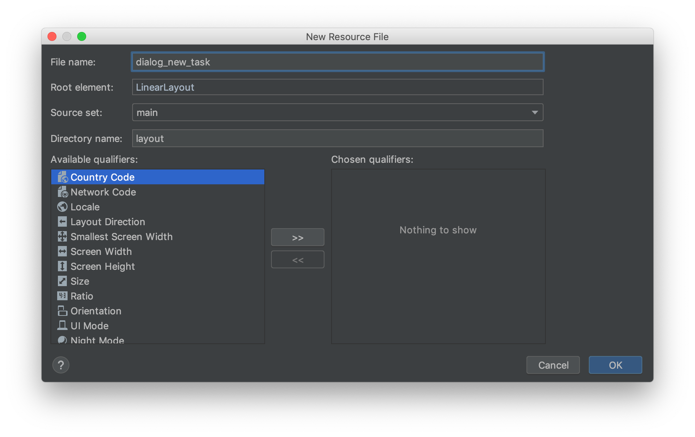
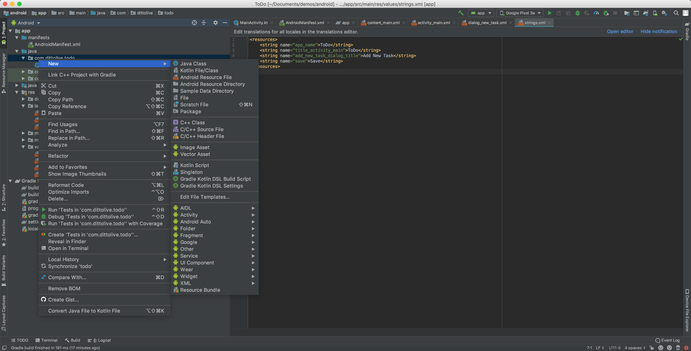

## 2-1 Adjust Existing Layouts

Navigate to the `content_main.xml` layout file and replace the XML in the text representation view. This will remove the existing text view and a recycler view that we will use to display the list of tasks:

```xml title=content_main.xml
<?xml version="1.0" encoding="utf-8"?>
<androidx.constraintlayout.widget.ConstraintLayout xmlns:android="http://schemas.android.com/apk/res/android"
    xmlns:app="http://schemas.android.com/apk/res-auto"
    xmlns:tools="http://schemas.android.com/tools"
    android:layout_width="match_parent"
    android:layout_height="match_parent"
    app:layout_behavior="@string/appbar_scrolling_view_behavior"
    tools:context=".MainActivity"
    tools:showIn="@layout/activity_main">

    <androidx.recyclerview.widget.RecyclerView
        android:id="@+id/recyclerView"
        android:layout_width="match_parent"
        android:layout_height="match_parent" />
</androidx.constraintlayout.widget.ConstraintLayout>
```

The layout should look like this:


Now navigate to `activity_main.xml` layout file and replace the XML in the text representation view. This will adjust the floating action button to use a white add icon:

```xml title=activity_main.xml
<?xml version="1.0" encoding="utf-8"?>
<androidx.coordinatorlayout.widget.CoordinatorLayout xmlns:android="http://schemas.android.com/apk/res/android"
    xmlns:app="http://schemas.android.com/apk/res-auto"
    xmlns:tools="http://schemas.android.com/tools"
    android:layout_width="match_parent"
    android:layout_height="match_parent"
    tools:context=".MainActivity">

    <com.google.android.material.appbar.AppBarLayout
        android:layout_width="match_parent"
        android:layout_height="wrap_content"
        android:theme="@style/Theme.Tasks.AppBarOverlay">

        <androidx.appcompat.widget.Toolbar
            android:id="@+id/toolbar"
            android:layout_width="match_parent"
            android:layout_height="?attr/actionBarSize"
            android:background="?attr/colorPrimary"
            app:popupTheme="@style/Theme.Tasks.PopupOverlay" />

    </com.google.android.material.appbar.AppBarLayout>

    <include layout="@layout/content_main" />

    <com.google.android.material.floatingactionbutton.FloatingActionButton
        android:id="@+id/addTaskButton"
        android:layout_width="wrap_content"
        android:layout_height="wrap_content"
        android:layout_gravity="bottom|end"
        android:layout_margin="@dimen/fab_margin"
        android:tint="#FFFFFF"
        app:srcCompat="@android:drawable/ic_input_add" />

</androidx.coordinatorlayout.widget.CoordinatorLayout>
```

The layout should look like this now:


## 2-2 Create AlertDialog Layout

We now need to create a new layout resource file to define our alert dialog. Right click on the layouts folder in the project and Go to `File → New → XML → Layout XML`


Name the resource file `dialog_new_task`



Open the new `dialog_new_task.xml` layout file and replace the XML in the text representation view. This will add an editable text input to allow the user to enter the task:

```xml title=dialog_new_task.xml
<?xml version="1.0" encoding="utf-8"?>
<LinearLayout xmlns:android="http://schemas.android.com/apk/res/android"
    android:orientation="vertical" android:layout_width="match_parent"
    android:layout_height="match_parent">

    <EditText
        android:id="@+id/editText"
        android:layout_width="match_parent"
        android:layout_height="match_parent"
        android:inputType="text" />
</LinearLayout>

```

The layout should look like this now:


## 2-3 Define Strings

We need to create a few string constants. Open `strings.xml` in the `/res/values` folder and replace it with this XML:

```xml title=strings.xml
<resources>
    <string name="app_name">Tasks</string>
    <string name="action_settings">Settings</string>
    <string name="title_activity_main">Tasks</string>
    <string name="add_new_task_dialog_title">Add New Task</string>
    <string name="save">Save</string>
</resources>

```

## 2-4 Create DialogFragment

To use the `AlertDialog` we will create a `DialogFragment`. Create a new Kotlin class by right clicking the app folder within java in the project view:



Name the new file `NewTaskDialogFragment`:


Replace the contents of `NewTaskDialogFragment.kt` with this:


```kotlin title=NewTaskDialogFragment.kt
package live.ditto.tasks

import android.app.Activity
import android.app.AlertDialog
import android.app.Dialog
import android.os.Bundle
import android.widget.TextView
import androidx.fragment.app.DialogFragment

class NewTaskDialogFragment: DialogFragment() {

    interface NewTaskDialogListener {
        fun onDialogSave(dialog: DialogFragment, task: String)
        fun onDialogCancel(dialog: DialogFragment)
    }

    var newTaskDialogListener: NewTaskDialogListener? = null

    companion object {
        fun newInstance(title: Int): NewTaskDialogFragment {
            val newTaskDialogFragment = NewTaskDialogFragment()
            val args = Bundle()
            args.putInt("dialog_title", title)
            newTaskDialogFragment.arguments = args
            return newTaskDialogFragment
        }
    }

    override fun onCreateDialog(savedInstanceState: Bundle?): Dialog { // 5
        val title = arguments!!.getInt("dialog_title")
        val builder = AlertDialog.Builder(activity)
        builder.setTitle(title)

        val dialogView = activity!!.layoutInflater.inflate(R.layout.dialog_new_task, null)
        val task = dialogView.findViewById<TextView>(R.id.editText)

        builder.setView(dialogView)
            .setPositiveButton(R.string.save) { _, _ -> newTaskDialogListener?.onDialogSave(this, task.text.toString()) }
            .setNegativeButton(android.R.string.cancel) { _, _ -> newTaskDialogListener?.onDialogCancel(this) }
        return builder.create()
    }

    @Suppress("DEPRECATION")
    override fun onAttach(activity: Activity) { // 6
        super.onAttach(activity)
        try {
            newTaskDialogListener = activity as NewTaskDialogListener
        } catch (e: ClassCastException) {
            throw ClassCastException("$activity must implement NewTaskDialogListener")
        }
    }
}

```
