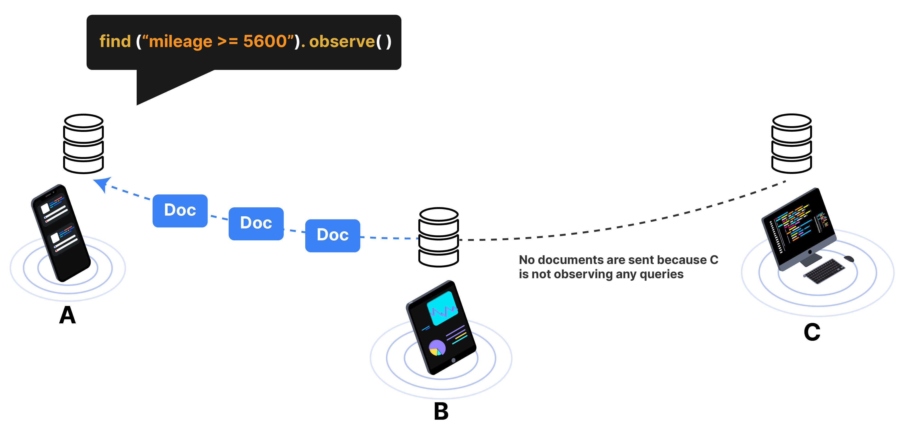

import Tabs from '@theme/Tabs';
import TabItem from '@theme/TabItem';
import SnippetGroup from '@site/src/components/SnippetGroup';

By default, Ditto will not sync data with other devices.  When the device is
observing a query, it requests to synchronize data that matches the query from
other devices in the mesh network. 

In other words, when a live query is created, Ditto's sync system
**pulls** data from other devices. There is no way to "push" data through the
API explicitly. Devices select data they are interested in through the query
system and then synchronize with the mesh network based on that query.



## Multi-hop replication

Given that Ditto works peer-to-peer, devices can form into arbitrary groups
based on the proximity to one another, or rather they create an ad-hoc mesh
network. Ditto's sync system allows for devices to share data through another
device, called "multi-hop" sync. The only requirement for this to occur is that
all devices in the chain must be observing the same data, as shown below:


## Sync

Ditto is a pull-based sync system, which means each device needs to explicitly tell other peers what data to sync and when to sync it.

Preferably, you should tell ditto to start syncronizing early on in your application's life cycle like in your `AppDelegate.application(_:didFinishLaunchingWithOptions:)` or `Application.onCreate` method. Your application only needs to call this function once.

<SnippetGroup
  name='sync-basic' 
/>


### Subscribe

Creating a subscription acts as a signal to other peers that you are interested in
receiving updates when local or remote changes are made to
documents that match the given query. 

The returned Subscription object must be kept in scope for as long as
you want to keep receiving updates. Subscribe is different than `observe`
because a callback is not required. This can be more memory efficient. This function is useful if you're just interested in subscribing to changes on a query to have a local offline copy of the data, but do not want to operate on the results.

<SnippetGroup name="subscribe" />

### Observe

Create a query with `.observe` to get notified when data changes. The returned LiveQuery object must be kept in scope for as long as
you want to keep receiving updates. [Learn more about how to create queries](./querying)

<SnippetGroup name="sync-observe" />

* Call `.observe` after `ditto.startSync()` to synchronize and download real-time data from other peers.
* The callback will immediately run for documents that fit the query.
* The callback will get called with both local and remote changes that fit the query. 
* The callback will rerun for each sync or write transaction.
* You can create as many `LiveQuery` objects as you want.
* To manually stop the `liveQuery`, set it either to `null`, drop the variable, or call `liveQuery.stop()`


### Sync only relevant documents

To reduce memory and disk usage over time, *ONLY* sync documents that are relevant for a given device at a
given time. There are various approaches to this problem, and it depends on your application.

For example, if you are building a meal ordering application, you may want to
only syncronize all orders that have been created in the past 24 hours. 

```swift
ditto.store.collection("orders").find("createdAt > $args.yesterday", args: [
  "yesterday": Date().adding(hr:-24),
]).observe({ cars, event in
     // do something
})
```

If there are 2,000 orders per day, you would see 2,000 documents
locally on the device. If each document is 50Kb, the device could 
replicate up to ~100 megabytes to the local database. 


## Eviction

When you subscribe to data that is relevant, you need to remove it from the
local device once it is no longer relevant. You want to remove data from the
local database _without_ deleting that data on other devices. 

This operation is different than remove in that it only removes one of more
documents from the local storage and **does not sync the change to other
devices.**

<SnippetGroup
  name='evict' 
/>

## Examples

### 1: Time-based syncing

One common design pattern is to only syncronize data that was written within the
past 24 hours. At the end of that 24 hours, documents older than 24 hours are evicted and a
new query is created.

Let's look through a typical example for syncing data: four flight attendants walk
through an airlane and record passenger meal orders on their tablets. 

The database has a `flights` collection, with each flight represented as a
document. Each document has a `createdAt` timestamp.

```json
{
  "createdAt": "2022-09-17T20:00:46.945Z",
  "flightNo": "DIT101",
  "orders": {
    "abcdef123": {
      ...
    }
  }
}
```

We want to only hold data on the device that was created in the past 24 hours.
Anything older than 24 hours should be removed locally from the device. However,
we don't want to remove this data from the entire mesh network, because we may
want to do analytics on it later using the Big Peer. So, we do not use remove() because that deletes data from the entire network, including the Cloud. We use `evict()` to remove data from the local device because it is not relevant anymore.

```swift
ditto.store.collection("flights").find("createdAt > $args.yesterday", args: [
  "yesterday": yesterday(),
]).subscribe()
```

Once a day, the device evicts the data locally to free up storage, and
restarts the query with a new date. Notice that the query for eviction is exactly the opposite as the query for subscription. These queries should not overlap.

```swift
ditto.store.collection("flights").find("createdAt <= $args.yesterday", args: [
  "yesterday": yesterday(),
]).evict()
```

### 2. Stateful syncing

Another common design pattern is to build state into each document type. In an
ordering application, orders go through a lifecycle.

OPEN -> IN PROGRESS -> COMPLETE -> FILLED  
|
-> CANCELLED

When the application starts, the device only wants to syncronize orders that are not
filled or cancelled, and evict any orders that have been completed.

```swift
self.query =  self.ditto.collection("orders")
  .find("status != 'FILLED' && status != 'CANCELLED'")
  .subscribe()
self.ditto.collection("orders").find("status == FILLED || status == CANCELLED").evict()
```

Once an order has been completed, document as “FILLED”. Live queries will fire and update the front-page.

```swift
self.ditto.collection("orders").upsert([
  "_id": id,
  "status": "FILLED"
])
```

An order could also become cancelled whlie it was unfilled. A cancelled order is
based on the business logic -- for example, an order could be cancelled
manually, or cancelled when the store closes, or because the order was placed
more than 24 hours prior. 

```swift
self.ditto.collection("orders").upsert([
  "_id": id,
  "status": "CANCELLED"
])
self.ditto.collection("orders").findByID(id).evict()
```
