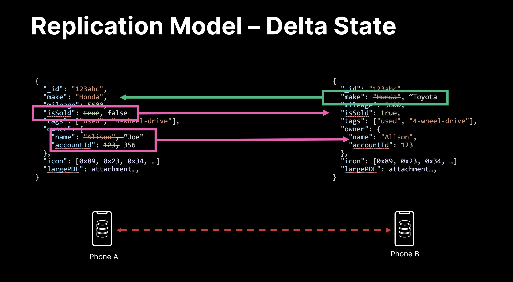

import Tabs from '@theme/Tabs';
import TabItem from '@theme/TabItem';
import SnippetGroup from '@site/src/components/SnippetGroup';

Ditto is a distributed database that optimizes for availability, which means
that you can always write to your local database even if you are disconnected
from the internet. Writes from all peers will synchronize and Ditto will resolve
any conflicts.

## Upserting 

 Ditto doesn't have a concept of "inserting" data, only "upserting" data. This
 means that each each device must assume that their operations are *upserts* on
 documents that may already exist on some other device in the network. This is because it is
 possible that the current device just hasn't synchronized that document yet.

### Creating a document

If you do not supply an `_id`, Ditto will create one for you and return it. Note that the `_id` is
 immutable.  This means that you cannot change the `_id` once you have upserted
 the document.
 
<SnippetGroup name="upsert" />

### Upserting with a specific `_id`

__Upserting__ also supports behavior where you would want to modify fields in a
document, even if the document `_id` does not not exist.  

As an example, let's say we have a document in the `people` collection that looks like this:

```jsonc
{
  "_id": "123abc",
  "name": "Sam",
  "age": 45,
  "isOnline": false
}
```

When you `upsert` a document, only the supplied fields will be modified. Existing fields are left unmodified. 

<SnippetGroup
  name='upsert-id' 
/>

This results in the `name` and `age` changing, but `isOnline` is untouched:

```jsonc
{
  "_id": "123abc",
  "name": "Susan",
  "age": 31,
  "isOnline": false
}
```

Ditto is a delta state CRDT, which means Ditto only replicates the data that has changed. This makes Ditto very fast.




### Default Data

Default Data can be thought of as "placeholder" data.  Default Data is useful when your app needs to load "starter" data from an external data source, like from a backend API, on multiple devices without creating odd "overwriting" behavior.

Ditto's approach to conflict resolution orders changes by time. In most situations, this leads to predictable behavior. However, if your application is upserting the same initial data into multiple devices, such as common data from a central backend API, this could result in overwriting later changes:

1. Device A upserts a document `{"firstName": "Adam"}` at time = 0 after downloading from a central API.
2. Device A updates the document to `{"firstName": "Max"}` at time = 1.
3. Device B synchronizes with Device A receiving the document `{"firstName": "Max"}` at time = 2.
4. Device B downloads the same document from the backend API `{"firstName": "Adam"}` and upserts at t = 3, which overwrites the previous change synced at time = 1.

In the above example, both Device A and B want to preserve the change by Device A that occurred after downloading the common data. To do so, Ditto offers an additional parameter: isDefault.

<SnippetGroup
  name='upsert-default-data' 
/>

## Updating existing documents

Updating an existing document is different depending on the type being updated

[Register](../datamodel/register)

* Set - sets value for a given key in the document
* Remove - removes a value for a given key in the document

[Counter](../datamodel/counter)

* Replace with counter - will convert a number value for a given key into a counter
* Increment - unlike a number, a counter allows for increment operations (decrement is performed by incrementing by a negative increment) and these operations will converge

[Map](../datamodel/map)

* Set - sets value for a given key in the map
* Remove - removes a value for a given key in the map

<SnippetGroup
  name='update' 
/>

## Batching multiple updates in a single transaction

A write transaction allows a device to perform multiple operations within a
single database call, that will be synchronized at the same time to other
devices. You can perform insert, update, remove or evict operations on multiple
collections more efficiently using this method.

:::warning
You cannot combine `remove()` and `upsert()` on the same document in the same write transaction. This is because you cannot update a document that has been removed.
:::

<SnippetGroup name="write-transaction" />
