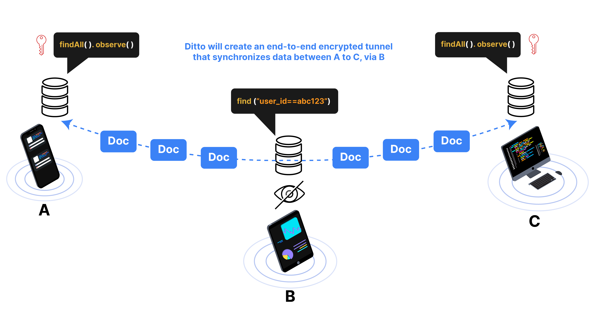

import SnippetGroup from '@site/src/components/SnippetGroup';

Query Overlap Groups are an optional feature that can be used to group peers
based on their anticipated queries, and set relative connection priorities
amongst these groups.

By default, Ditto queries will replicate only documents that match a query between
peers. In some cases, two peers with the same query might be separated by others
who do not share the same query. Consider a simple example of three peers
connected in a line (A - B - C). If A and C share the same query but B does not,
data will not replicate from A to C as B is not interested in the data - and
therefore doesn’t possess it to replicate onwards.

If your use-case includes non-overlapping queries like this example, query
overlap groups are designed to help. You can use Query Overlap Groups to tell
Ditto that peers A and C are likely to have queries that overlap. 

:::warning
Ditto will create an end-to-end encrypted tunnel for A - C via B. However, Query Overlap Groups are not a security mechanism. A peer may change its Query Overlap Group at runtime for any reason.
:::

### Use Cases

* High priority syncronization between same group members
* Ensuring that peers with the same query can fully replicate with each other, even if they are separated by other peers that don’t have the same queries.

## Code Example

In this example, we have built a meal ordering app where passengers can see their own
orders, and crew members see all orders. We want the crew devices to use the
passenger devices as multihop points that syncronizes all orders in the
background, even though the passenger devices aren't observing all orders.

For all peers in a high-priority Query Overlap Group, Ditto will prioritize
these connections, and set up end-to-end encrypted multihop connections if
direct connections aren’t available. In doing so, the crew can be sure that
their data will remain in sync, even if they’re separated by other passenger devices
in the local mesh.

<SnippetGroup name="network-query-overlap-group" />

###  What do the numbers mean?

The numeric value for a query overlap group is entirely use-case specific and
apps are free to use whichever values they like - provided all peers agree on
the meaning of the values. All peers belong to query overlap group 0 initially
and will connect with normal priority until specified otherwise. The number that
represents the query group doesn’t mean that the group has higher priority. The
number is just an enum to represent the group. To assign priority, see
[Setting Priority](#setting-priority) below.

## Setting priority

You can configure the priority with which Ditto should connect to any peers in the given
Query Overlap Group. If the priority is set to high, an end-to-end encrypted
multihop connection will be established wherever it is not possible to establish
a direct connection. Connections can be established in either direction, so
the remote peers might attempt connections to this Ditto with different
priorities unless they are similarly configured.

In our above example, passenger apps can configure a high-priority connection
preference for crew members. In doing so, passenger devices establish a direct
connection to crew member devices if possible, and otherwise establish an end-to-end encrypted
connection hopping via other passengers if needed. The end-to-end encrypted
connection guarantees passenger-to-crew replication without personal information
being readable by other passengers along the way.

Extending our previous example, here we configure the crew devices with the
query overlap group “2” to treat other peers in group “2” as a high-priority
connection target. 

<SnippetGroup name="network-set-priority" />

You could also use this pattern to prevent peers from connecting if you know the
connection would be wasteful. Perhaps you know that different types of peers or
apps don’t share any data in common. In this case, peers can be assigned to the
relevant Query Overlap Group, and the priority can be set to the lowest value of
“don’t connect”. The peers will then save their available connection capacity
for other, potentially more useful connections.