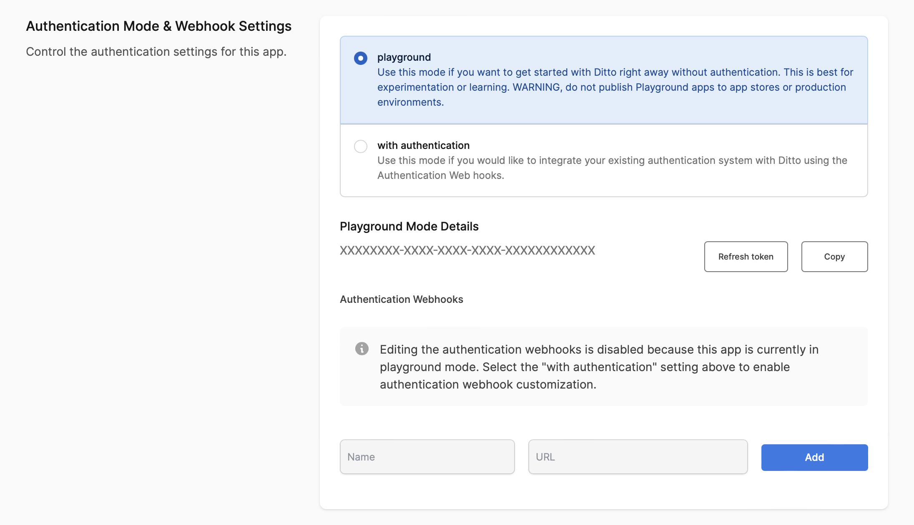

import Tabs from '@theme/Tabs';
import TabItem from '@theme/TabItem';
import SnippetGroup from '@site/src/components/SnippetGroup';

Ditto synchronizes data *with* or *without* the Internet. Experimental or demo apps
can start synchronizing over the Internet using an `onlinePlayground` application.
apps are simply apps that can sync with the Big Peer that have the same `appID`.
Online playground applications have __no restrictions to data__ and each peer is
randomly assigned a unique `userID`. Online playgrounds are perfect for learning
about how to use Ditto's APIs without worrying about security architecture.

* Apps with Online Playground can read and write to all collections.
* Apps with Online Playground will connect to other peer devices or a Big Peer app with __same appID__.

For integrating authentication with an OAuth client, see
[onlineWithAuthentication](/security/online-with-authentication/overview).

To use Online Playground, go to your app in the Ditto portal and find the __Authentication Mode & Webhook Settings__ section. Ensure that __"Playground"__ is selected like so:

:::caution
__DO NOT__ publish an app with Ditto to an end-user with an Online Playground
configuration. We call this a Playground because it's meant for learning without
having to implement any true security. 
:::

Now in your client app, construct your Ditto instance with an online playground identity:

<SnippetGroup name="online-playground" />

Now your application will automatically sync with any near by peers and cloud apps with the same `appID`.
