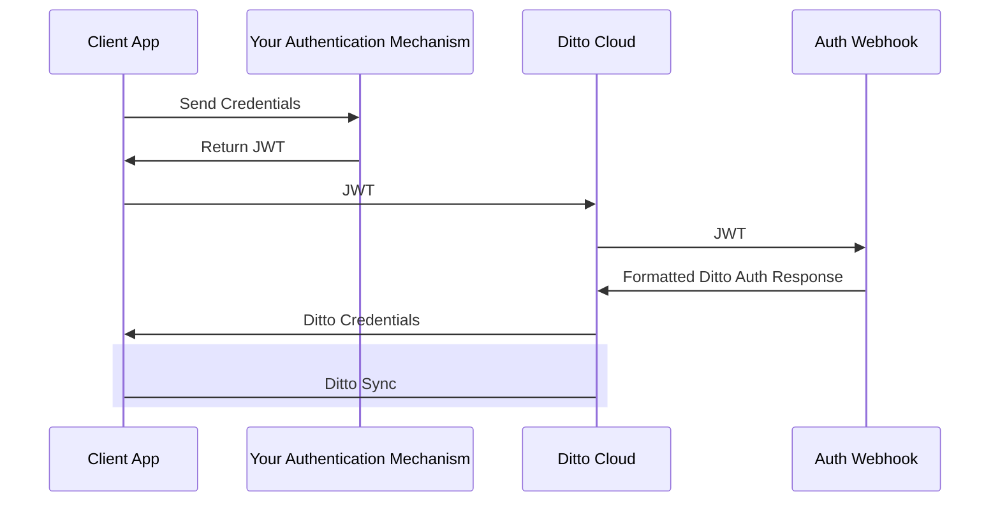
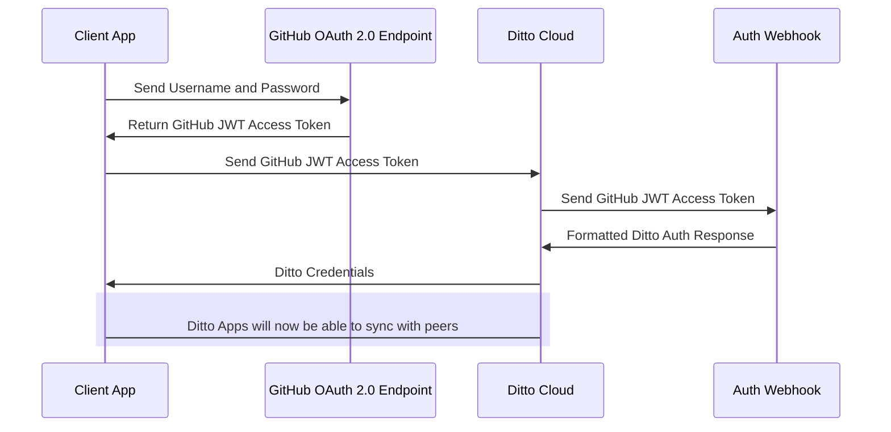

The "Online With Authentication" identity type is geared towards apps will be deployed in real world settings. "Online With Authentication" identity types are: 

* for apps that need to integrate with existing permissions
* for apps that need to integrate with existing authentication systems

:::info
* __This section will require knowledge of writing server side HTTP endpoints and handlers.__ The server side sample codes are written in JavaScript (NodeJS with an [Express](https://expressjs.com/)-like API), however you can use any framework or language of your choosing.
* The Ditto platform __does not come with an identity provider__. Using "Online With Authentication" requires that that you have your own identity provider already set up. Each app can use multiple identity providers. Identity providers can be:
  * Your own service
  * Facebook, Twitter, GitHub, etc...
  * Okta, Auth0, Stytch, etc...
:::

To use the "Online With Authentication" system, your client application is expected to authenticate with your identity system and retrieve some sort of token _prior_ to syncing with Ditto. Often times this token is some sort of identity token, access token, commonly in the format of a JWT (JSON Web Token).

Once your client application successfully has retrieved this token, it should pass it to the Ditto `authenticator` which will pass it to an authentication webhook. As the developer, you are responsible for writing code and deploying the this webhook to an accessible URL. The authentication webhook will validate and decode the token from the client side and return identity and access control information back to your Ditto instance. 

The full flow is detailed in the diagram below:

As an example, let's say you've decided to use GitHub's OAuth 2.0 flow to identify users in your application:

