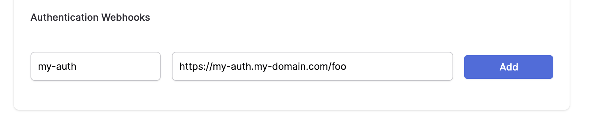

The authentication webhook needs to handle an __HTTP POST__ request. Each client that will need to authenticate will send a payload to this webhook. The following section requires that you have knowledge of writing server side HTTP endpoints and responding with a JSON payload. Code samples of server side code are written with a NodeJS / Express syntax. You can use any language or framework on the server side. 

This section will not cover how to write server side code in depth or how to deploy your server side. 

## Incoming POST body

When your client device wants to authenticate using your webhook, your code will receive an HTTP post with a JSON payload that looks like:

```jsonc 
{
  "appID": "ce914163-2df7-4985-9821-7034891cdcda", // the appID
  "provider": "my-auth", // this is the "Name" of the "Authentication Webhook"
  "token": "eyJhbGciOiJI..." // this is what each device will send to authenticate
}
```

Your can introspect these values by parsing out the request body:

```js
server.post('/', (req, res) => {
  const appID = req.body.appID
  const provider = req.body.provider
  const token = req.body.token
})
```

## Rejecting a user

To reject a user respond with a JSON payload below. You do not need to manipulate the HTTP response status.

```jsonc
{
  "authenticate": false
}
```

Generally, you will want to check the token for some sort of validity. Let's assume you have some sort of library or logic to parse and validate the token is for a specific user. You can use the `userInfo` key in your JSON response to pass information back to client.

```js
server.post('/', async (req, res) => {
  const token = req.body.token;
  try {
    const { userId } = await checkToken(token)
    // omitted for brevity
  } catch (err) {
    res.json({
      "authenticate": err,
      "userInfo": err.message
    }) 
  }
})
```

### Accepting a user and granting permissions

To accept a user, the JSON payload needs to contain information about:

* `authenticate` to `true` to tell the webhook that the user has successfully validated
* `expirationSeconds` is `number` property on how long the authentication session is valid for before a refresh is required.
* `userID` is a `string` which identifies the the `userID`. This should be _unique_ across users within your app. 
* `permissions` which describes all the types of access control for collections and documents that this user can `read` or `write`

An example response might look like this:

```jsonc
{
  "authenticate": true,
  "expirationSeconds": 28800,
  "userID": "123abc",
  "permissions": {
    "read": {
      "everything": false,
      "queriesByCollection": {
        "books": [
          "endsWith(_id, 'Potter')"
        ],
        "my_collection": [
          "_id == 'my-specific-id'",
          "_id == 'id1' || _id == 'id2'"
        ],
        "my_favorite_integers": [
          "_id > 100",
          "_id > -10 && _id < 10"
        ],
        "test": [
          "true"
        ],
        "weird_bools_collection": [
          "_id == false"
        ]
      }
    },
    "write": {
      "everything": false,
      "queriesByCollection": {
        "boats": [
          "regex(_id, '^Wave.*')"
        ],
        "test": [
          "true"
        ]
      }
    }
  }
}
```


#### The `permissions` response key

The permissions key in your JSON response describes access control rules for the user. It has two required sub keys `write` and `read`. 

##### Granting full permissions on all collections and all documents

To grant full `read` permissions to _all collections_ and _all documents_:

```jsonc
{
  "authenticate": true,
  "expirationSeconds": 28800,
  "userID": "123abc",
  "permissions": {
    // highlight-start
    "read": {
      "everything": true,
      "queriesByCollection": {}
    },
    "write": {
      "everything": false,
      "queriesByCollection": {}
    }
    // highlight-end
  }
}
```

To grant full `write` permissions to _all collections_ and _all documents_:

```jsonc
{
  "authenticate": true,
  "expirationSeconds": 28800,
  "userID": "123abc",
  "permissions": {
    "read": {
      "everything": false,
      "queriesByCollection": {}
    },
    "write": {
      "everything": true,
      "queriesByCollection": {}
    }
  }
}
```

To grant full `read` & `write` permissions to _all collections_ and _all documents_:

```jsonc
{
  "authenticate": true,
  "expirationSeconds": 28800,
  "userID": "123abc",
  "permissions": {
    "read": {
      "everything": true,
      "queriesByCollection": {}
    },
    "write": {
      "everything": true,
      "queriesByCollection": {}
    }
  }
}
```

##### Granting selective permissions on certain documents

To grant selective permissions on specific documents, add to the `queriesByCollection` property inside either the `read` or `write` property. Each key inside `queriesByCollection` is a reference to the collection. Each value is an array of [ditto queries](/concepts/querying) describing which documents the user can read or write.

:::info
Currently, you can __only specify a permission query on the `_id` field of a document__. Mutable properties are currently not supported. We are working on adding this feature.
:::

The following write permissions below describe that `userID: "123abc"` can

1. `write` to documents in the `"books"` collection where the `_id.title` value `endsWith('Potter')`.
2. `write` to any document in the `"newspapers"` collection. We use a single value of `true` 
3. `read` to documents in the `"books"` collection where the `_id.title` value `endsWith('Potter')`.

```jsonc
{
  "authenticate": true,
  "expirationSeconds": 28800,
  "userID": "123abc",
  "permissions": {
    "write": {
      "everything": false, // ensure that this is false
      "queriesByCollection": {
        // highlight-start
        // 1. 
        "books": [
          "endsWith(_id.title, 'Potter')"
        ],
        // highlight-end
        
        // highlight-start
        // 2. 
        "newspapers": [
          "true"
        ]
        // highlight-end
      }
    },
    "read": {
      "everything": false, // ensure that this is false
      "queriesByCollection": {
        // highlight-start
        // 3.
        "books": [
          "endsWith(_id.title, 'Potter')"
        ],
        // highlight-end
      }
    }
  }
}
```

Finally, deploy this application to a server that can be accessible by Ditto's cloud platform. __You will need the URL in the next section.__

## Configure your Portal App

To use an "Online With Authentication" identity, go to your app in the [portal](https://portal.ditto.live/) and find the __Authentication Mode & Webhook Settings__ section. Ensure that __"With Authentication"__ is selected like so:


Below, a section called __Authentication Webhooks__ will be editable. Once your Authentication Webhook Endpoint(s) is deployed and ready, you can register it in the portal. Add a __Name__ and __URL__. 

* The __Name__ is used the differentiate between multiple authentication. Most applications will have one authentication webhook, however the __Name__ parameter is still required. This name value is important for the next section.
* The __URL__ parameter is the fully qualified URL of the webhook that you deployed in the section above. Please include the protocol (_https:// or http://_ though we highly discourage _http://_). Please be sure that this endpoint is not behind a firewall or VPN. If you cannot get around this requirement [contact us](mailto:contact@ditto.live). 



Click __Add__ to register the webhook in your portal app. Now client applications that need to authenticate will be able to use these endpoints.