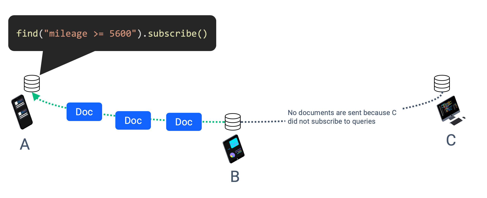
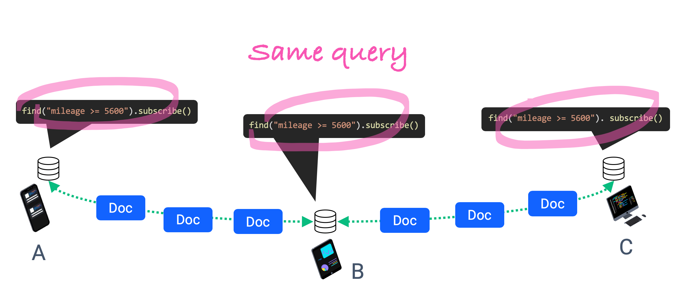

import Tabs from '@theme/Tabs';
import TabItem from '@theme/TabItem';

## Overview

The most important API, which is fundamental to working with Ditto, is the ability to observe data changes. This allows your app to be reactive, simplifying your architecture, and abstracting the timing complexity of data sync that is occurring in the background. Instead of performing, point-in-time queries, your app can simply register a query to observe, which is called a `LiveQuery`, and you will receive callbacks whenever data changes related to it.

This allows you to decouple actions in your applications with UI updates. You can bind your UI to a `LiveQuery` and then simply perform writes to Ditto from your actions elsewhere in the app. The `LiveQuery` will fire in response to those other actions and whenever data is received from other devices as well.

### Query-Based Sync

Ditto's sync system is query-based, which means, that by default the SDK will not sync data with other devices. Instead, the app creates query-based subscriptions that define which data it wants to sync. When the device is subscribed to a query, then other devices will share data matching that query with it:



Given that Ditto works peer-to-peer, devices can form into arbitrary groups based on the proximity to one another, or rather they create an ad-hoc mesh network. Ditto's sync system allows for devices to share data through another device, called "multi-hop" sync. The only requirement for this to occur is that all devices in the chain must be subscribed to the same data, as shown below:



## Enabling Sync

To enable Ditto to sync data, you'll need to call `ditto.tryStartSync()`. Preferably, you should call `tryStartSync()` early on in your application's life cycle like in your `AppDelegate.application(_:didFinishLaunchingWithOptions:)` or `Application.onCreate` methods. Your application only needs to call this function once.

<Tabs
  groupId="programming-language"
  defaultValue="javascript"
  values={[
    {label: 'JavaScript', value: 'javascript'},
    {label: 'Swift', value: 'swift'},
    {label: 'Objective-C', value: 'objc'},
    {label: 'Kotlin', value: 'kotlin'},
    {label: 'Java', value: 'java'},
    {label: 'C#', value: 'csharp'},
    {label: 'C++', value: 'cpp'},
    {label: 'Rust', value: 'rust'},
  ]
}>
<TabItem value="javascript">

```js
const ditto = new Ditto()
try {
    ditto.tryStartSync()
} catch(err) {
    console.error(err)
}
```

</TabItem>
<TabItem value="swift">

```swift
let ditto = new Ditto()
try {
    ditto.tryStartSync()
} catch(let err) {
    print(err.localizedDescription)
}
```

</TabItem>
<TabItem value="objc">

```objc
NSError *error = nil;
[ditto tryStartSync:&error];
```

</TabItem>
<TabItem value="kotlin">

```kotlin
try {
    ditto.tryStartSync()
}
catch (e: DittoError) {
    assertThat(e.message).isEqualTo("The license failed verification. Obtain a valid license token at https://portal.ditto.live.")
}
```

</TabItem>
<TabItem value="java">

```java
try {
    ditto.tryStartSync();
} catch(DittoError e) {
    Log.e("Ditto", e.getMessage())
}
```

</TabItem>
<TabItem value="csharp">

```csharp
try
{
    ditto.TryStartSync();
}
catch (DittoException ex)
{
    Console.WriteLine(exception.ToString());
}
```

</TabItem>
<TabItem value="cpp">

```cpp
try {
    ditto.try_start_sync();
} catch (const DittoError &err) {
    std::cerr << e.what();
}
```

</TabItem>
<TabItem>

```rust
fn main() -> Result<(), Box<dyn Error>> {
    ditto.try_start_sync()?;
}
// Or ...
if let Err(e) = ditto.try_start_sync() {
    eprintln!("Error starting Ditto sync: {:?}", e);
}
```

</TabItem>
</Tabs>

## Syncing Data with Live Queries

Ditto will only sync data with other peers when it has an active `LiveQuery`. A `LiveQuery` is a long-running subscription to a constructed Ditto query. Use a query to specify what types of data to sync with other devices. [Learn more about how to create queries](./querying)

The easiest way to create a `LiveQuery`, simply add `.observe` to a query cursor. This API combines two different actions related to observing changes. First, it registers an observer which will fire a callback whenever any data changes related to this query. Second, it also creates a subscription for data from other devices based off the query. For simple applications, using `.observe` is easier. However, for more complex applications, where you might want to subscribe to a larger query of data from other devices whenever the app is running, but then have specific live queries for subsets of the data tied to certain views. You can separate the two actions, as described in [`Subscriptions`](#subscriptions) below.

To create a LiveQuery, add `.observe` to a query cursor like so:

<Tabs
  groupId="programming-language"
  defaultValue="javascript"
  values={[
    {label: 'JavaScript', value: 'javascript'},
    {label: 'Swift', value: 'swift'},
    {label: 'Objective-C', value: 'objc'},
    {label: 'Kotlin', value: 'kotlin'},
    {label: 'Java', value: 'java'},
    {label: 'C#', value: 'csharp'},
    {label: 'C++', value: 'cpp'},
    {label: 'Rust', value: 'rust'},
  ]
}>
<TabItem value="javascript">

```js
const liveQuery = ditto.store.collection('cars')
    .find("color == 'red'")
    .observe((cars, event) => {
        // do something
    })
```

</TabItem>
<TabItem value="swift">

```swift
// Register live query to update UI
let liveQuery = ditto.store.collection("cars").find("color == 'red'")
  .observe { cars, event in
    // do something
  }
```

</TabItem>
<TabItem value="objc">

```objc
// Register live query to update UI
DITLiveQuery *liveQuery = [[collection find:@"color == 'red'"]
    observe:^(NSArray<DITDocument *> *docs, DITLiveQueryEvent *event) {

    }
}];
```

</TabItem>
<TabItem value="kotlin">

```kotlin
// --- Register live query to update UI
this.liveQuery = ditto.store.collection("cars").
    .findAll()
    .observe { docs, event ->
        // Do something...
    }
```

</TabItem>
<TabItem value="java">

```java
// --- Register live query to update UI
this.liveQuery = ditto.store.collection("cars")
    .findAll()
    .observe((docs, event) -> {
        // Do something...
    });
```

</TabItem>
<TabItem value="csharp">

```csharp
// --- Register live query to update UI
var liveQuery = ditto.Store.Collection("cars").Find("color == 'red'").Observe((docs, DittoLiveQueryEvent) =>
{
    // Do something...
});
```

</TabItem>
<TabItem value="cpp">

```cpp
std::shared_ptr<LiveQuery> query = collection
  .find("color == 'red'")
  .observe(LiveQueryEventHandler{
    [&](std::vector<Document> docs, LiveQueryEvent event) {
      // do something
    }});
```

</TabItem>
<TabItem value="rust">

```rust
let store = ditto.store(); // Ditto must have a longer lifetime than all live queries
let (tx, rx) = channel();
{
    let live_query = store.collection("cars")?.find("color == \'red\'")
       .observe(move |docs, event| {
           match event {
               LiveQueryEvent::Initial {..} => {.. },
               LiveQueryEvent::Update {insertions, ..} => {
                   for idx in insertions.iter() {
                        if let Some(doc) = docs.get(*idx) {
                            let _ = tx.send(doc);
                        }
                   }
               },
               _ => () // do nothing
           }
       })?;
    for doc in rx.iter() {
        println!("Updated Doc: {:?}", &doc);
    }

} // IMPORTANT: LiveQuery goes out of scope and is Dropped and terminated here.
```

</TabItem>
</Tabs>


Here are some quick facts about the `LiveQuery` behavior.

* The `.observe` handler will always fire _immediately_ with the current set of documents matching the query.
* Subsequent local and remote calls to `.observe` will be fired with the new set of documents that match the query.
* To stop the observe callback, either call `liveQuery.stop()` or deallocate the `liveQuery` object. Deallocation can by done simply by assigning it to `nil` or `null` depending on the language and platform.
* You can create as many `LiveQuery` objects as you want.
* Calling `.observe` on a query before calling `ditto.tryStartSync()`, will only fire changes for local updates.

## Live Queries without Syncing Data

There are many situations where your app needs to observe live queries _without_ initiating syncing with other devices. For example, this is useful if your app intends to treat certain documents and collections as local-only data. In addition, for complex apps, it can be helpful to seperate the observer from the underlying query [`Subscription`](#subscriptions).

Instead of `.observe`, call `.observeLocal` like so:

<Tabs
  groupId="programming-language"
  defaultValue="javascript"
  values={[
    {label: 'JavaScript', value: 'javascript'},
    {label: 'Swift', value: 'swift'},
    {label: 'Objective-C', value: 'objc'},
    {label: 'Kotlin', value: 'kotlin'},
    {label: 'Java', value: 'java'},
    {label: 'C#', value: 'csharp'},
    {label: 'C++', value: 'cpp'},
    {label: 'Rust', value: 'rust'},
  ]
}>
<TabItem value="javascript">

```js
const liveQuery = ditto.store.collection('cars')
    .find("color == 'red'")
    .observeLocal((cars, event) => {
        // do something
    })
```

</TabItem>
<TabItem value="swift">

```swift
// --- Action somewhere in your application
func userDidInsertCar() {
    _ = ditto.store.collection("cars").insert([
        "model": "Ford",
        "color": "black"
    ])
}

// Register live query to update UI
let liveQuery = ditto.store.collection("cars").find("color == 'red'")
  .observeLocal { cars, event in
    // do something
  }
```

</TabItem>
<TabItem value="objc">

```objc
// --- Action somewhere in your application
-(void) userDidInsertCar() {
    [[ditto.store collection:@"cars"] insert:@{
        @"model": @"Ford",
        @"color": @"black"
    }];
}

// Register live query to update UI
DITLiveQuery *liveQuery = [[collection find:@"color == 'red'"]
    observeLocal:^(NSArray<DITDocument *> *docs, DITLiveQueryEvent *event) {

    }
}];
```

</TabItem>
<TabItem value="kotlin">

```kotlin
// --- Action somewhere in your application
fun userDidInsertCar() {
    ditto.store.collection("cars").insert(mapOf(
        "model" to "Ford",
        "color" to "black"
    ))
}

// --- Register live query to update UI
this.liveQuery = ditto.store.collection("cars").
    .findAll()
    .observeLocal { docs, event ->
    // Do something...
}
```

</TabItem>
<TabItem value="java">

```java
// --- Action somewhere in your application
public void userDidInsertCar() {
    Map<String, Object> content = new HashMap<>();
    content.put("model", "Ford");
    content.put("color", "black");
    ditto.store.collection("cars").insert(content);
}

// --- Register live query to update UI
this.liveQuery = ditto.store.collection("cars")
    .findAll()
    .observeLocal((docs, event) -> {
        // Do something...
    });
```

</TabItem>
<TabItem value="csharp">

```csharp
// --- Action somewhere in your application
// --- Action somewhere in your application
void user_did_insert_car()
{
    var carsDocument = new Dictionary<string, object>
    {
        { "model", "Ford" },
        { "color", "black" }
    };
    ditto.Store.Collection("cars").Insert(carsDocument);
}

// --- Register live query to update UI
var localLiveQuery = ditto.Store.Collection("cars").Find("color == 'red'").ObserveLocal((docs, DittoLiveQueryEvent) =>
{
    // Do something...
});
```

</TabItem>
<TabItem value="cpp">

```cpp
// --- Action somewhere in your application
void user_did_insert_car() {
    ditto.store.collection("cars").insert({
        {"model", "Ford"},
        {"color", "black"}
    });
}

// --- Register live query to update UI
std::shared_ptr<LiveQuery> query = collection
  .find("color == 'red'")
  .observe_local(LiveQueryEventHandler{
    [&](std::vector<Document> docs, LiveQueryEvent event) {

    }});
```

</TabItem>
<TabItem value="rust">

```rust
// Some action in your app ...
let store = ditto.store();
let mut doc_id;
{
    let doc_id = store.collection("cars")?.insert(car_1, None, false)?;
}
// Elsewhere register handlers for data changes
{
    let shared_element = RwLock::new(my_element);
    let element_copy = shared_element.clone();
    let live_query = store.collection("cars")
        .find("color == \'red\'")
        .observe_local(move |cars, event|{
            let element = element_copy.write().unwrap();
            // do something when data changes
            // BUT this closure must be permitted to take ownership
        })?;
    // stash your live query in something with a long lifetime
    // or it will be dropped
}
```

</TabItem>
</Tabs>

Note: if your Ditto instance has not called `tryStartSync`, there will be no difference between `.observe` and `.observeLocal`.

## Subscriptions

In developing more complex applications, it might make sense to decouple your `LiveQuery` observer callbacks with the query `Subscription`. For example, if you want the app to always be subscribing to data during the entire life-cycle of the app, but only create an observer when the user navigates to the UI for that data. In this case, you would use the `.observeLocal` API while registering a `Subscription` for the query in a global area of the app.

To create subscriptions is similar to, or can also be combined with, [local observers](#live-queries-without-syncing-data):

<Tabs
  groupId="programming-language"
  defaultValue="javascript"
  values={[
    {label: 'JavaScript', value: 'javascript'},
    {label: 'Swift', value: 'swift'},
    {label: 'Objective-C', value: 'objc'},
    {label: 'Kotlin', value: 'kotlin'},
    {label: 'Java', value: 'java'},
    {label: 'C#', value: 'csharp'},
    {label: 'C++', value: 'cpp'},
    {label: 'Rust', value: 'rust'},
  ]
}>
<TabItem value="javascript">

```js
// Register a subscription globally in the app
const subscription = ditto.store.collection('cars')
    .find("color == 'red'")
    .subscribe()

// Register a local observer to update UI
const liveQuery = ditto.store.collection('cars')
    .find("color == 'red'")
    .observeLocal((cars, event) => {
        // do something
    })
```

</TabItem>
<TabItem value="swift">

```swift
// Register a subscription globally in the app
let subscription = ditto.store.collection("cars")
    .find("color == 'red'")
    .subscribe()

// Register a local observer to update UI
let liveQuery = ditto.store.collection("cars").find("color == 'red'")
  .observeLocal { cars, event in
    // do something
  }
```

</TabItem>
<TabItem value="objc">

```objc
// Register a subscription globally in the app
DITSubscription *subscription = [[collection find:@"color == 'red'"] subscribe];

// Register a local observer to update UI
DITLiveQuery *liveQuery = [[collection find:@"color == 'red'"]
    observeLocal:^(NSArray<DITDocument *> *docs, DITLiveQueryEvent *event) {

    }
}];
```

</TabItem>
<TabItem value="kotlin">

```kotlin
// Register a subscription globally in the app
this.subscription = ditto.store.collection("cars").
    .findAll()
    .subscribe()

// Register a local observer to update UI
this.liveQuery = ditto.store.collection("cars").
    .findAll()
    .observeLocal { docs, event ->
    // Do something...
}
```

</TabItem>
<TabItem value="java">

```java
// Register a subscription globally in the app
this.subscription = ditto.store.collection("cars").
    .findAll()
    .subscribe();

// Register a local observer to update UI
this.liveQuery = ditto.store.collection("cars")
    .findAll()
    .observeLocal((docs, event) -> {
        // Do something...
    });
```

</TabItem>
<TabItem value="csharp">

```csharp
// Register a subscription globally in the app
var subscription = ditto.Store.Collection("cars").Find("color == 'red'").Subscribe();

// Register a local observer to update UI
var localLiveQuery = ditto.Store.Collection("cars").Find("color == 'red'").ObserveLocal((docs, DittoLiveQueryEvent) =>
{
    // Do something...
});
```

</TabItem>
<TabItem value="cpp">

```cpp
// Register a subscription globally in the app
Subscription subscription = collection
  .find("color == 'red'")
  .subscribe();

// Register a local observer to update UI
std::shared_ptr<LiveQuery> query = collection
  .find("color == 'red'")
  .observe_local(LiveQueryEventHandler{
    [&](std::vector<Document> docs, LiveQueryEvent event) {

    }});
```

</TabItem>
<TabItem value="rust">

```rust
// subscription triggers sync behavior, asks remote peers to push data
// you need to be able to store this data
let subscription = ditto.store().collection("cars").find("color == \'red\'").subscribe()?;

// Observe local changes to data to update UI
let query = ditto.store().collection("cars").find("color == \'red\'").observe_local()?;
```

</TabItem>
</Tabs>

Note: if your Ditto instance has not called `tryStartSync`, `.subscribe` will not enable sync.
