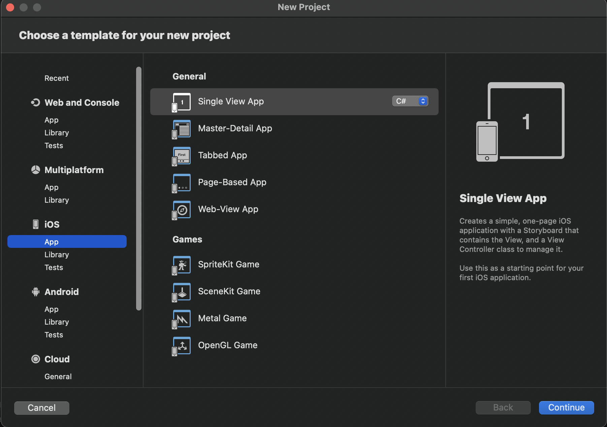
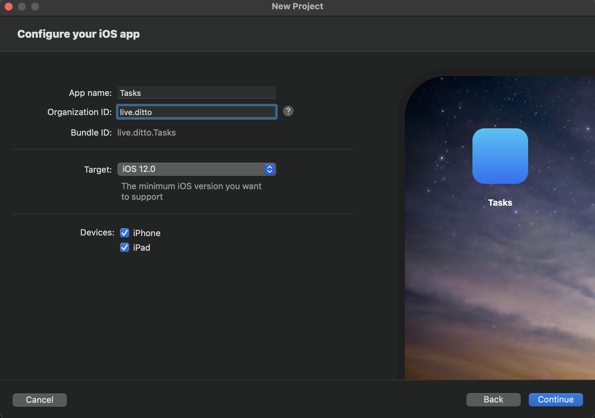

:::info
Xamarin.iOS is currently supported on physical devices, however the iOS
simulator is not supported yet. Xamarin.Android is support is coming soon.
:::

The following guide will show you how to build a task list application using Xamarin.
This tutorial also shows you how to build an example user interface for iOS.

Follow the [official Xamarin guide for Android](https://docs.microsoft.com/en-us/xamarin/android/get-started/)
for Android-specific code samples.

## macOS

Before getting started, you will need the latest version of
[Xcode](https://apps.apple.com/us/app/xcode/id497799835) and
[Visual Studio 2022 for Mac](https://visualstudio.microsoft.com/downloads/).

Once the Visual Studio installer is complete, launch Visual Studio and open the
Preferences dialog (`Visual Studio` menu -> `Preferences...`, or the `⌘,` keyboard shortcut).

Navigate to the `Build and Debug -> SDK Locations -> .NET Core` section on the left.
Under `.NET Core Command Line` browse to or enter the following in the `Location:` box:

```command
/usr/local/share/dotnet/dotnet
```

In addition, you should have a decent familiarity with C# and UIKit.

## Windows

Xamarin.Android development can be done entirely on a Windows box, but a Mac
with Xcode is required for some parts of Xamarin.iOS development.
It is possible to [Pair to Mac](https://docs.microsoft.com/en-us/xamarin/ios/get-started/installation/windows/connecting-to-mac/)
from Visual Studio on a Windows PC.

## 1-1 Create the App

Once you've installed the latest version of Xcode and Visual Studio, Open Visual Studio and click
**File > New Project** under `IOS` select `App` and then `Single View App`. Make sure language is `C#`



Fill out the information on the form similar to the screenshot below. These are
recommended values however they are not crucial to complete this tutorial:


- App Name: `"Tasks"`
- Organization Identifier: `"live.ditto"`. However, feel free to use your own value here.
- Target: iOS 12.0




And finally click "Continue" and select a directory to create the application.

## 1-2 Add dependencies (Package Manager)

Follow the instructions on the [Installation page for C#](/csharp/installation) to
use Package Manager or .NET CLI.

Now open **Tasks.csproj**.
