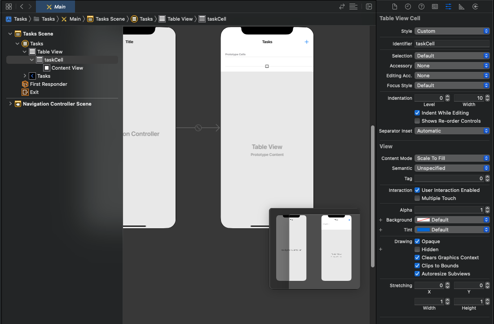

## 2-1 Create Your Ditto App

Before we start coding, we first need to create a new app in the [portal](https://portal.ditto.live). Apps created on the portal will automatically sync data between them and also to the Ditto Big Peer.

Each app created on the portal has a unique `appID` which can be seen on your app's settings page once the app has been created. This ID is used in subsequent sections to configure your Ditto instance.

## 2-2 Add Permissions to the `Info.plist`

For Ditto to fully use all the network transports like Bluetooth Low Energy, Local Area Network, Apple Wireless Direct, the app will need to ask the user for permissions. These permission prompts need to be in the **Info.plist** file of your project.

1. Locate the **Info.plist** file and open it
2. Create 4 new entries using the `key, string` pairs below.

```xml title=Info.plist
<key>NSBluetoothAlwaysUsageDescription</key>
<string>Uses Bluetooth to connect and sync with nearby devices</string>
<key>NSBluetoothPeripheralUsageDescription</key>
<string>Uses Bluetooth to connect and sync with nearby devices</string>
<key>NSLocalNetworkUsageDescription</key>
<string>Uses WiFi to connect and sync with nearby devices</string>
<key>NSBonjourServices</key>
<array>
  <string>_http-alt._tcp.</string>
</array>
```

## 2-3 Add `ditto` to `AppDelegate.cs`

When Visual Studio generated your project, there should be a file called **AppDelegate.cs**. We will need an instance of Ditto throughout this tutorial and the app's lifecycle.

1. First import Ditto with `using DittoSDK`
2. Next, we'll need to hold a reference to our Ditto instance
3. After the app has finished launching we will add a working directory. Currently, Xamarin.iOS apps need to provide a working directory inside the app's sandbox. Without this, the default directory used by the SDK won't be writable and an exception will be thrown.
4. Construct an instance of Ditto with an online playground identity using the APP ID and Playground Token of the app that you just created on the portal. We are using an `.OnlinePlayground` setup, which should suffice for this tutorial. However, you should never deploy this to a production environment.
5. We want to enable all peer to peer transport configurations
6. We will call `startSync()`. This method can throw an error in the event that the license token is invalid or expired.

```csharp title=AppDelegate.cs
using Foundation;
using UIKit;
using System;

//1
// highlight-next-line
using DittoSDK;

namespace Tasks
{
    // The UIApplicationDelegate for the application. This class is responsible for launching the
    // User Interface of the application, as well as listening (and optionally responding) to application events from iOS.
    [Register ("AppDelegate")]
    public class AppDelegate : UIResponder, IUIApplicationDelegate {

        [Export("window")]
        public UIWindow Window { get; set; }

        //2
        // highlight-next-line
        internal Ditto ditto;

        [Export ("application:didFinishLaunchingWithOptions:")]
        public bool FinishedLaunching (UIApplication application, NSDictionary launchOptions)
        {

            //3
            // highlight-start
            NSFileManager fileManager = new NSFileManager();
            NSUrl url = fileManager.GetUrl(NSSearchPathDirectory.DocumentDirectory, NSSearchPathDomain.User, null, true, out NSError error);
            if (error != null)
            {
                Console.WriteLine($"Error creating Documents directory: {error.LocalizedDescription}");
            }
            url = url.Append("ditto", true);

            fileManager.CreateDirectory(url, true, null, out error);
            if (error != null)
            {
                Console.WriteLine($"Error creating ditto directory: {error.LocalizedDescription}");
            }

            string workingDir = url.Path;
            // highlight-end

            //4
            //highlight-start
            DittoIdentity identity = DittoIdentity.OnlinePlayground(appID: "REPLACE_ME", token: "REPLACE_ME"
, false, workingDir: workingDir);

            ditto = new Ditto(identity, workingDir);
            //highlight-end

            //5
            //highlight-start
            var transportConfig = new DittoTransportConfig();
            transportConfig.EnableAllPeerToPeer();
            ditto.TransportConfig = transportConfig;
            //highlight-end

            //6
            // highlight-next-line
            ditto.StartSync();

            return true;
        }

        // UISceneSession Lifecycle

        [Export ("application:configurationForConnectingSceneSession:options:")]
        public UISceneConfiguration GetConfiguration (UIApplication application, UISceneSession connectingSceneSession, UISceneConnectionOptions options)
        {
            // Called when a new scene session is being created.
            // Use this method to select a configuration to create the new scene with.
            return UISceneConfiguration.Create ("Default Configuration", connectingSceneSession.Role);
        }

        [Export ("application:didDiscardSceneSessions:")]
        public void DidDiscardSceneSessions (UIApplication application, NSSet<UISceneSession> sceneSessions)
        {
            // Called when the user discards a scene session.
            // If any sessions were discarded while the application was not running, this will be called shortly after `FinishedLaunching`.
            // Use this method to release any resources that were specific to the discarded scenes, as they will not return.
        }
    }
}
```

## 2-4 Create a `Task` class

Ditto is a document database, which represents all of its rows in the database a JSON-like structure. In this tutorial, we will define each task like so:

```jsonc
{
  "_id": "123abc",
  "body": "Get Milk",
  "isCompleted": true
}
```

These Task documents will all be in the "tasks" collection. We will be referencing this collection throughout this tutorial with:

```csharp
var tasksCollection = ditto.Store["tasks"]
```

Create a new cs file called `Task.cs` in your project.

1. Import Ditto with `using DittoSDK`
2. Add the matching variables `public string _id;`, `public string body;`, and `public bool isCompleted;` to the class. We will use this to match the document values to to the class.
3. Add a constructor to `Task` that takes in a `DittoDocument`. Parse out the document's keys with Ditto's type safe value accessors. This will safely map all the document's values to the struct's variables that we created in step 1.

```csharp title="Task.cs"
// 1
using DittoSDK;

namespace Tasks
{
    public class Task
    {
        // 2
        public string _id;
        public string body;
        public bool isCompleted;

        // 3
        public Task(DittoDocument document)
        {
            this._id = document["_id"].StringValue;
            this.body = document["body"].StringValue;
            this.isCompleted = document["isCompleted"].BooleanValue;
        }
    }
}
```

Once we set up our user interface, you'll notice that reading these values becomes a bit easier with this added class.

## 2-5 Create the user interface

When we generated the project, Visual Studio created a default `Main.StoryBoard` file.

1. Right click on `Main.storyboard` and select `Open With > Xcode Interface Builder`. This will open up the Xcode application and allow you to design the user interface inside of Xcode using storyboards.
2. When Xcode opens select the `Main` file and open it. Delete the default ViewController.
3. Open the UI components Library and type "Navigation Controller" into the search. Drag a new Navigation Controller onto the screen. This will create a Navigation Controller and a Root View Controller with a Table View. Select the Navigation Controller and make sure the box `Is Initital View Controller` is selected.
4. Open the UI components Library again and type in "Bar Button Item". Drag the button to the top right of the "Root View Controller" screen. Then, select the button, go to the Inspector panel and select the `Attributes` inspector. Change System Item to `Add`. This will make the bar button item we just added into a ''**+**'' Sign
5. Select the Root View Controller top bar. Then go to the Inspectors panel and select the `identity` inspector. We will create a custom class for this View Controller. In the Class section type "TasksTableViewController".


6. Next, select the `Prototype cells` and give it an identifier of `taskCell`



8. Save that file in Xcode, then open the poject up in Visual Studio again. At this point, Visual Studio should have auto generated two files for you. A `TasksTableViewController.cs` file and a `TasksTableViewController.designer.cs` file. These are the class files that were created from the TasksTableViewController we created in Xcode.
9. Open the project up in Xcode again and you should now see two new files added to the project directory. A `TasksTableViewController.h` file and a `TasksTableViewController.m` file.
10. Open the Main.storyboard file. While pressing the `control` button on your keyboard select the button and drag under the `@interface SceneDelegate : UIResponder { }` code inside the `TasksTableViewController.h` file. Fill the information as follows:

- Connection: `Action`
- Name: `didClickAddTask`
- Type: `UIBarButtonItem`

11. Save the file
