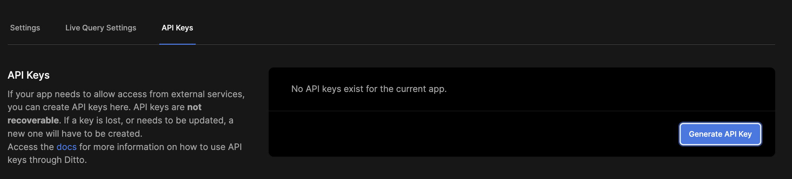
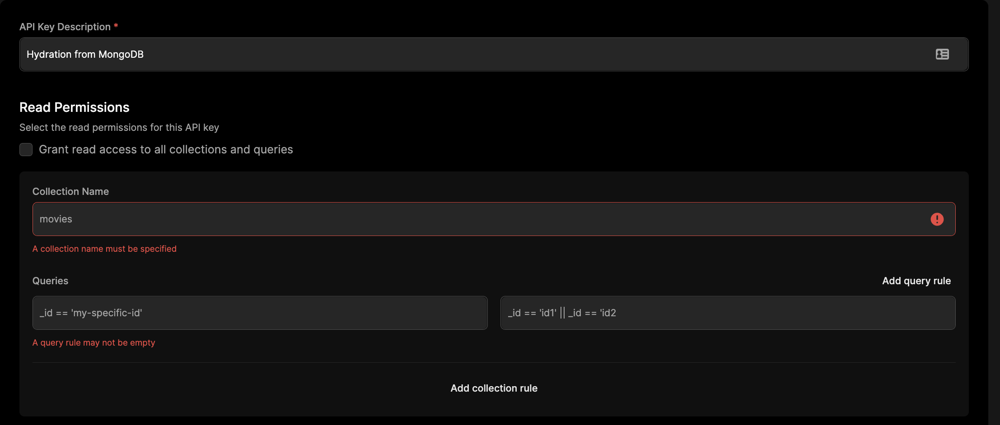

The Ditto HTTP API follows a RESTful pattern and is organized into several resources. API Resources typically map to the key elements of the [Ditto Data Model](../common/concepts/overview). Applications may contain one or more `Collection`s of `Documents` or `TimeSeries` of `Event`s. JSON is used as the default representation for individual resources, and will be indicated by the `Content-Type` HTTP Header. Resources which are best represented by a sequence or stream of items are represented by [JSONlines](https://jsonlines.org), that is new line delimited JSON. This will be indicated by the MIME type `application/json-l`. UTF-8 encoding is used and required unless otherwise indicated. Binary data should be Base64 encoded. Where alternative representations are desired, the API Client may use the `Accept` HTTP Header to indicate this in the Request.

<!-- Currently, Collections and TimeSeries can't be edited directly as top level API resources; only operations on the underlying documents are supported. Collections and TimeSeries are created implicitly by inserting into them. Later, we may add the ability to create, configure, and delete entire collections and timeseries directly.-->
<!-- This document is intended to serve as a public facing guide to the entire HTTP API at the time we deliver Particle phase 1. Items for future work or discussion will be called out in comments like this. -->

## Introduction

For simple examples for using the HTTP API for document storage, see the
corresponding sections in the Concepts section for
[querying](./common/concepts/querying), [writing](./common/concepts/writing),
and [remove](./common/concepts/remove). Ditto Big Peer also provides HTTP APIs for querying timeseries data. See the
[timeseries section](./timeseries) for more information.

### Endpoint

The Ditto HTTP API provides a programmatic interface for interactions with
Ditto-powered Apps which expose an HTTP Server Interface. A primary use case for
the HTTP API is external systems which integrate with `cloud.ditto.live`.

The canonical root URL for the HTTP API can be found in your app's page on the Ditto Portal. The standard port 443 is used.

```bash
curl https://{app_id}.cloud.ditto.live/api/v2
```

### Generating a Client ID

An `X-DITTO-CLIENT-ID` is required whenever issuing POST requests to the HTTP
API. You should generate one for each client, as this ID represents a client in
the Ditto mesh. 

:::info
### Generate this ID once and cache it for the duration of each client.  

Client IDs are used to resolve conflicts as part of the [CRDT](../common/how-it-works/crdt). Generating a new ID for each request will cause performance issues, because each
client represents a new device in the ditto mesh.  
:::

```python
>>> import base64
>>> site_id = 5
>>> epoch = 0
>>> site_id_bytes = site_id.to_bytes(8,'big')
>>> epoch_bytes = epoch.to_bytes(8, 'big')
>>> actor_id_bytes = site_id_bytes + epoch_bytes
>>> actor_id_bytes
b'\x00\x00\x00\x00\x00\x00\x00\x05\x00\x00\x00\x00\x00\x00\x00\x00'
>>> base64.b64encode(actor_id_bytes)
b'AAAAAAAAAAUAAAAAAAAAAA=='
```

## Authorization 

Access to the Ditto HTTP API is mediated by an `Authorization: Bearer` HTTP
Header containing a valid, signed, JWT Token (RFC 7519).

### API Key

Long-lived API tokens are great for server-side hydration, which are not owned
by a particular user. These API keys can be obtained and managed through the
portal in the "API Key" section. 



You can give each API key it's own read and write permissions, scoped to particular collections or document ids. 

:::info
Currently, you can only specify a permission query on the _id field of a document. Mutable properties are currently not supported. We are working on adding this feature.
:::



Once you have your API Key, you can use it as part of the `Authorization: Bearer` HTTP header in subsequent HTTP requests.

```
curl --location --request POST 'https://{YOUR_APP_ID}.cloud.ditto.live/api/v2/store/write' \
--header 'X-DITTO-CLIENT-ID: AAAAAAAAAAAAAAAAAAAABQ==' \
--header 'Authorization: Bearer {YOUR_API_KEY}' \
--header 'Content-Type: application/json' \
--data-raw '{
    "commands": [{
      "method": "upsert",
      "collection": "people",
      "value": {
        "name": "Susan", "age": 31
      }
    }]
  }'
```


### Online With Authentication

There are specific cases where a broad, long-lived HTTP API key is not the right
authorization mechanism. For user-scoped credentials, you can use a JWT retrieved from [Online With
Authentication](../common/security/online-with-authentication) to secure your
HTTP endpoint. To retrieve a JWT for a particular user, send a POST request to the Big Peer
with the given provider and the user's token.

```
curl --location \
    --request POST '{YOUR_APP_ID}.cloud.ditto.live/_ditto/auth/login' \
    --data-raw 'appId={YOUR_APP_ID}&provider={YOUR_PROVIDER}&token={USER_TOKEN}&siteId=1'
```

Once you have this token, you can use it as part of the `Authorization: Bearer` HTTP header in subsequent requests (as seen in the previous section).

### Errors

Ditto HTTP API errors are indicated with an HTTP Status Code and with a JSON response body containing an object with a single "error" key. This Error object contains the following fields:

- error.code - The HTTP Status Code for
- error.message - A short description of the error
- error.data - An optional object which contains further elaboration about the error


## Advanced

### Transactions

A successful response to POST or DELETE requests will include a
Transaction ID, which can be used on subsequent GET requests. This type of
insertion is non-blocking and so is very performant.

Each HTTP API write request represents a distinct transaction which may be one
or many operations (e.g., upsert or remove). Because Ditto is also a distributed
system, `Transaction ID`s are used to represent the order in which transactions
should be applied. Each write request returns it's associated `Transaction ID`. 

GET requests can optionally specify a Transaction ID in an HTTP
HEADER called `X-DITTO-TXN-ID`. This header will instruct the
server to wait until the given transaction is applied before executing the
query. The newly inserted events may still be replicating through the Ditto mesh
between the time of the write and the time of the find request. If you don't supply this header, the default behavior is to use the
most recent version common to all Ditto nodes. If the Ditto node
servicing the Request can't supply the version of the data requested, an error
will be returned.

For example, you write data using the HTTP API and get back Transaction 17. If
you want to ensure that the values included in Transaction included in our
subsequent query, we would include the header `X-DITTO-TXN-ID: 17` in the next request. 


### Remove Wins

Ditto uses "remove-wins" semantics, so in some situations the client may want to
force Ditto to first read its current data and ensure another peer hasn't issued
a concurrent DELETE request before attempting an insertion with a POST request.
To do this, the client provides the HTTP HEADER `X-DITTO-ENSURE-INSERT: true`.
