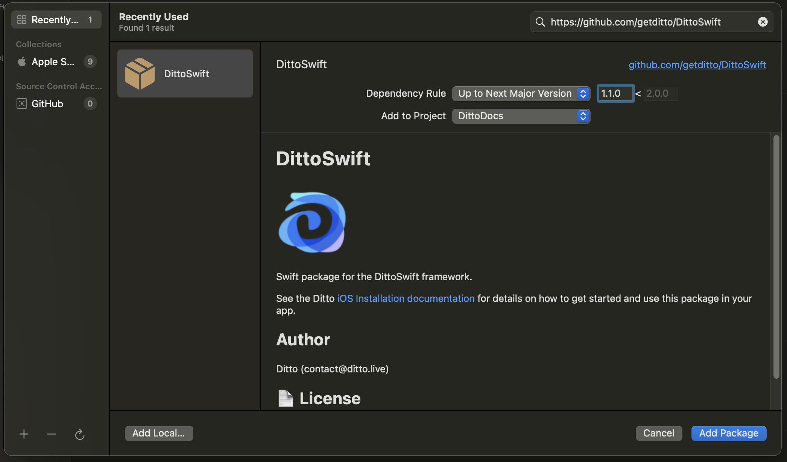
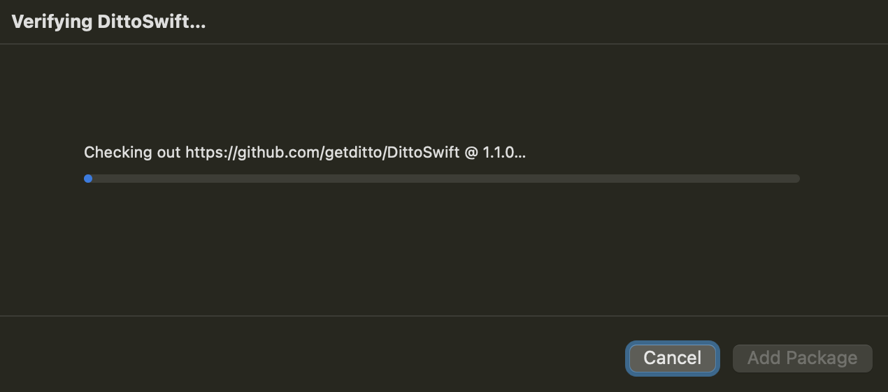
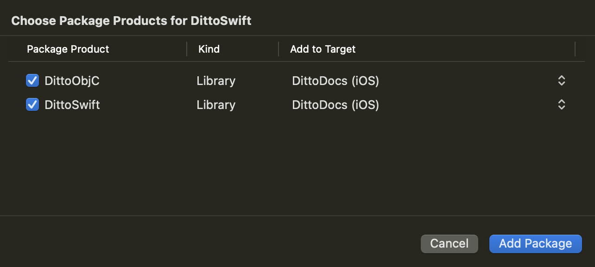

import Tabs from "@theme/Tabs";
import TabItem from "@theme/TabItem";
import { InstallCode } from "../../src/components/Changelog.tsx";

<Tabs
  groupId="package-manager"
  defaultValue="swiftpm"
  values={[
    {label: 'Swift Package Manager', value: 'swiftpm'},
    {label: 'CocoaPods', value: 'cocoapods'},
  ]
}>

<TabItem value="swiftpm">

1. Open your Xcode project and select the "File" > "Add Packages..." menu entry.
   Enter the following package URL in search box in the upper right corner:
   - https://github.com/getditto/DittoSwiftPackage



See [Adding Package Dependencies to Your App](https://developer.apple.com/documentation/swift_packages/adding_package_dependencies_to_your_app#3512138)
for more details on this dialog.

2. Click the "Add Package" button.

Xcode will take a minute or two to download the Ditto package.



3. Select the package product(s) you want to use in your app.

- Swift apps: make sure to select **both** "DittoSwift" and "DittoObjC" :warning:
- Objective-C apps may select only "DittoObjC".



Click the "Add Package" button.

</TabItem>

<TabItem value="cocoapods">

1. [Ensure you have CocoaPods 1.1.0 or later](https://guides.cocoapods.org/using/getting-started.html)
2. Ensure you have `use_frameworks!` in your Podfile
3. Add the following to your **Podfile** like so:

<Tabs
  groupId="programming-language"
  defaultValue="swift"
  values={[
    {label: 'Swift', value: 'swift'},
    {label: 'Objective-C', value: 'objc'},
  ]
}>
<TabItem value="swift">

<InstallCode framework="cocoa" variant="swift" />

</TabItem>
<TabItem value="objc">

<InstallCode framework="cocoa" variant="objc" />

</TabItem>
</Tabs>

And run `pod install --repo-update` to install the latest versions.

</TabItem>
</Tabs>

4. Navigate to your App's **Target** and go to the **Info** tab and right click on any row and **Add Row**.


5. _Add_ the following keys to your Info.plist.

<Tabs
groupId="info-plist"
  defaultValue="info-tab"
  values={[
    {label: "From Info Tab", value: 'info-tab'},
    {label: "From Source Code", value: 'source-code'},
  ]
}>

<TabItem value="info-tab">

Add the following values to your Info tab.

```
Key: NSBluetoothAlwaysUsageDescription
Type: String
Value: Uses Bluetooth to connect and sync with nearby devices

Key: NSBluetoothPeripheralUsageDescription
Type: String
Value: Uses Bluetooth to connect and sync with nearby devices

Key: NSLocalNetworkUsageDescription
Type: String
Value: Uses WiFi to connect and sync with nearby devices

Key: NSBonjourServices
Type: String
Value: _http-alt._tcp.
```

</TabItem>
<TabItem value="source-code">

If your app already has an **Info.plist** file, you can right click on it and **Open As Source** and add the following values.

```xml title=Info.plist
<key>NSBluetoothAlwaysUsageDescription</key>
<string>Uses Bluetooth to connect and sync with nearby devices</string>
<key>NSBluetoothPeripheralUsageDescription</key>
<string>Uses Bluetooth to connect and sync with nearby devices</string>
<key>NSLocalNetworkUsageDescription</key>
<string>Uses WiFi to connect and sync with nearby devices</string>
<key>NSBonjourServices</key>
<array>
  <string>_http-alt._tcp.</string>
</array>
```

</TabItem>

</Tabs>

The values like `Uses WiFi to connect and sync with nearby devices` will be displayed in a prompt. Replace it with whatever language is best for your users.

6. You can now use Ditto in your application:

<Tabs
  groupId="programming-language"
  defaultValue="swift"
  values={[
    {label: 'Swift', value: 'swift'},
    {label: 'Objective-C', value: 'objc'},
  ]
}>
<TabItem value="swift">

```swift
import DittoSwift

let ditto = Ditto()
try! ditto.setLicenseToken("my license token")
try! ditto.tryStartSync()
```

</TabItem>
<TabItem value="objc">

```objc
#import <DittoObjC/DittoObjC.h>


DITDitto *ditto = [[DITDitto alloc] init];
NSError *error = nil;

if (![ditto setLicenseToken:@"my license token": error:&error]) {
  NSLog(@"Error setting license token: %@", error);
}

if (![ditto tryStartSync:&error]) {
  NSLog(@"Error starting sync: %@", error);
}
```

</TabItem>
</Tabs>
