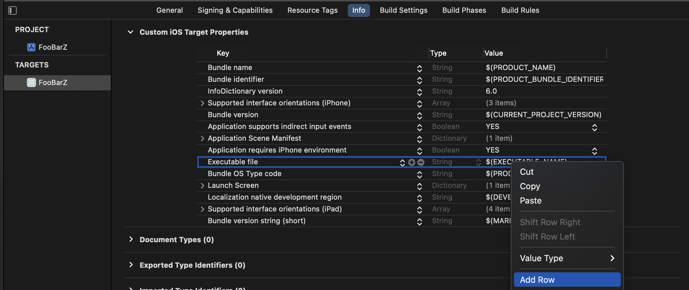

import { Snippet } from '@site/src/components/SnippetGroup';
import Tabs from "@theme/Tabs";
import TabItem from "@theme/TabItem";
import { InstallCode } from "@site/src/components/Changelog.tsx";

### Compatibility

:::info
Supported in iOS 11 and above. 
:::

|  | LAN | AWDL | Bluetooth |
|---|---| ---|---|
iOS | ✓ | ✓ | ✓| 
macOS | ✓ | ✓ | ✓ |

### Setup

<Tabs
  groupId="package-manager"
  defaultValue="swiftpm"
  values={[
    {label: 'Swift Package Manager', value: 'swiftpm'},
    {label: 'CocoaPods', value: 'cocoapods'},
  ]
}>

<TabItem value="swiftpm">

1. Open your Xcode project and select the "File" > "Add Packages..." menu entry.
   Enter the following package URL in search box in the upper right corner:
   - https://github.com/getditto/DittoSwiftPackage


See [Adding Package Dependencies to Your App](https://developer.apple.com/documentation/swift_packages/adding_package_dependencies_to_your_app#3512138)
for more details on this dialog.

2. Click the "Add Package" button.

Xcode will take a minute or two to download the Ditto package.


3. Select the package product(s) you want to use in your app.

- Swift apps: make sure to select **both** "DittoSwift" and "DittoObjC" :warning:
- Objective-C apps may select only "DittoObjC".


Click the "Add Package" button.

</TabItem>

<TabItem value="cocoapods">

1. [Ensure you have CocoaPods 1.1.0 or later](https://guides.cocoapods.org/using/getting-started.html)
2. Ensure you have `use_frameworks!` in your Podfile
3. Add the following to your **Podfile** like so:

<Tabs
  groupId="programming-language"
  defaultValue="swift"
  values={[
    {label: 'Swift', value: 'swift'},
    {label: 'Objective-C', value: 'objc'},
  ]
}>
<TabItem value="swift">

<InstallCode framework="cocoa" variant="swift" />

</TabItem>
<TabItem value="objc">

<InstallCode framework="cocoa" variant="objc" />

</TabItem>
</Tabs>

And run `pod install --repo-update` to install the latest versions.

</TabItem>
</Tabs>

4. Navigate to your App's **Target** and go to the **Info** tab and right click on any row and **Add Row**.




### Platform permissions

<details>
<summary>Q: Why does Ditto need iOS Platform Permissions?</summary>

  Ditto attempts to use all the available networking capabilities of your device
  to locate and sync with other users of your app. This includes standard Wi-Fi
  (which we often refer to as LAN or Local Area Network) and peer-to-peer
  functionality such as AWDL and Bluetooth Low Energy.

  iOS restricts access to some of this functionality for the sake of user
  control and privacy. To unlock the full capabilities of Ditto, it is important
  to configure your app so that it requests all the permissions that it needs.
  These permissions are only asked once when you attempt to start the
  synchronization.

  Since iOS 13 and Xcode 11 an app must ask the user's permission to use
  Bluetooth. However, Ditto will activate Bluetooth by default, which means the
  user will receive a permission prompt automatically. In addition, since iOS 14
  an app must ask the user's permission to use the Local Area Network to discover
  devices.

  * Privacy - Local Network Usage Description
  * Privacy - Bluetooth Peripheral Usage Description
  * Privacy - Bluetooth Always Usage Description
  * A Bonjour service `_http-alt._tcp`.

</details>

<Tabs
groupId="info-plist"
  defaultValue="info-tab"
  values={[
    {label: "From Info Tab", value: 'info-tab'},
    {label: "From Source Code", value: 'source-code'},
  ]
}>

<TabItem value="info-tab">

5. _Add_ the following values to your Info tab.

```
Key: NSBluetoothAlwaysUsageDescription
Type: String
Value: Uses Bluetooth to connect and sync with nearby devices

Key: NSBluetoothPeripheralUsageDescription
Type: String
Value: Uses Bluetooth to connect and sync with nearby devices

Key: NSLocalNetworkUsageDescription
Type: String
Value: Uses WiFi to connect and sync with nearby devices

Key: NSBonjourServices
Type: String
Value: _http-alt._tcp.
```

</TabItem>
<TabItem value="source-code">

5. _Add_ the following keys to your Info.plist. 

```xml title=Info.plist
<key>NSBluetoothAlwaysUsageDescription</key>
<string>Uses Bluetooth to connect and sync with nearby devices</string>
<key>NSBluetoothPeripheralUsageDescription</key>
<string>Uses Bluetooth to connect and sync with nearby devices</string>
<key>NSLocalNetworkUsageDescription</key>
<string>Uses WiFi to connect and sync with nearby devices</string>
<key>NSBonjourServices</key>
<array>
  <string>_http-alt._tcp.</string>
</array>
```

</TabItem>

</Tabs>

The values like `Uses WiFi to connect and sync with nearby devices` will be displayed in a prompt. Replace it with whatever language is best for your users.

6. Under "Signing & Capabilities", it is recommended that you turn on both Bluetooth Background Modes for your app target. If you enable these, iOS will often let your app sync while it is in the background or even while the phone is locked. This provides a better experience for users.


7. Access the [portal](https://portal.ditto.live) to create a new app. Apps created on the portal will automatically sync data between them and also to the Ditto Big Peer. Each app created on the portal has a unique `appID` which can be seen on your app's settings page once the app has been created. This ID is used in subsequent sections to configure your Ditto instance.

8. You can now use Ditto in your application:

<Tabs
  groupId="programming-language"
  defaultValue="swift"
  values={[
    {label: 'Swift', value: 'swift'},
    {label: 'Objective-C', value: 'objc'},
  ]
}>
<TabItem value="swift">

<Snippet name='online-playground' language='swift' />


</TabItem>
<TabItem value="objc">

<Snippet name='online-playground' language='objc' />

</TabItem>
</Tabs>
