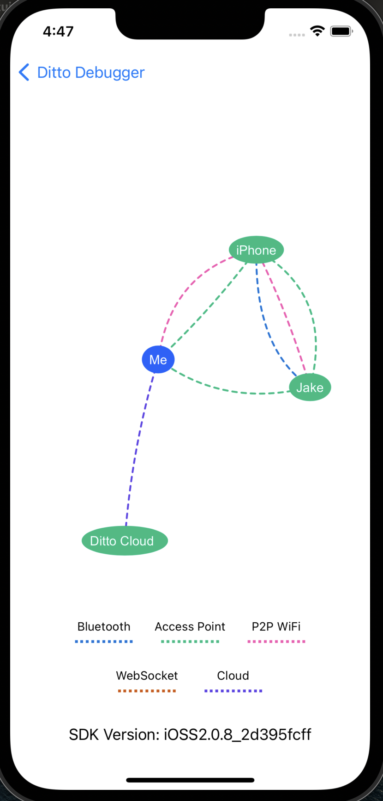

DittoSwiftTools is an iOS package that gives you access to the Ditto Presence Viewer and Disk Usage.

### Setup

1. Open your Xcode project and select the "File" > "Add Packages..." menu entry. Enter the following package URL in search box in the upper right corner:
    - [https://github.com/getditto/dittoswifttools](https://github.com/getditto/dittoswifttools)
    
2. Click the "Add Package" button.

Xcode will take a minute or two to download the Ditto package.

1. Select the package product(s) you want to use in your app.
    1. Presence Viewer
    2. Disk Usage (coming soon)

Click the "Add Package" button.

### Presence Viewer

The Presence Viewer allows you see a visualization of all the currently connected peers and the type of transport each peer is connected with.

1. Import the `DittoPresenceViewer`
2. Call the `PresenceView(YOUR_DITTO_INSTANCE)` method from your View

```
var body: some View {
  PresenceView(YOUR_DITTO_INSTANCE)
}
```


