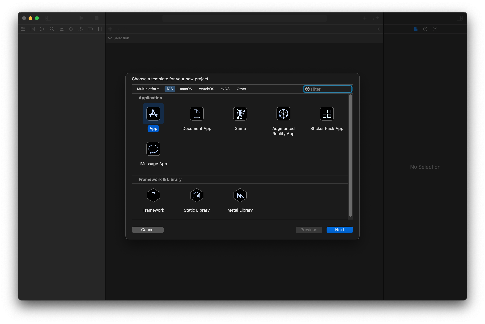

The following guide will show you how to build a task list application for iOS using [SwiftUI](https://developer.apple.com/documentation/swiftui/).

Before getting started, you will need the latest version of [Xcode](https://apps.apple.com/us/app/xcode/id497799835). This tutorial was written with Xcode 12.5.1. In addition, you should have a decent familiarity with Swift.

## 1-1 Create the App

Once you've installed the latest version of Xcode installed, Click __File > New Project__ and select `App`

Fill out the information on the form similar to the screenshot below. These are recommended values however they are not crucial to complete this tutorial:

* Name: `"Tasks"`
* Organization Identifier: `"live.ditto"`. However, feel free to use your own value here.
* Interface: SwiftUI
* Life Cycle: "UIKit App Delegate"
* Language: Swift

And finally click "Next" and select a directory to create the application.

## 1-2 Add dependencies (Cocoapods or Swift Package Manager)

Follow the instructions on the [Installation page for iOS](/ios/installation) to use CocoaPods or Swift Package Manager.
