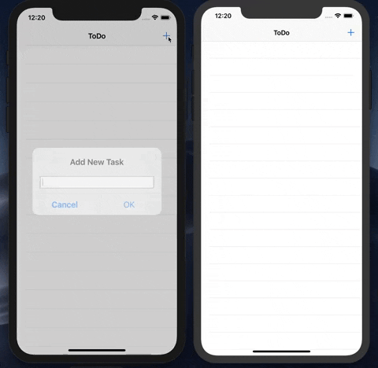

## 4-1 Select Task To Complete

When the user selects the task in the table view, we want to mark the task completed. Adjust your `TasksTableViewController` to include the following code (these functions were already created when the file was generated by Xcode):

```swift
 override func tableView(_ tableView: UITableView, didSelectRowAt indexPath: IndexPath) {
    // Deselect the row so it is not highlighted
    tableView.deselectRow(at: indexPath, animated: true)
    // Retrieve the task at the row selected
    let task = tasks[indexPath.row]
    // Update the task to mark completed
    collection.findByID(task.id).update({ (newTask) in
        newTask?["isCompleted"].set(!task["isCompleted"].boolValue)
    })
}

override func tableView(_ tableView: UITableView, canEditRowAt indexPath: IndexPath) -> Bool {
    // Return false if you do not want the specified item to be editable.
    return true
}
```

This action makes use of Ditto's `update()` API where we are able to find the existing task and set the `isCompleted` value to the opposite of its current value.

## 4-2 Swipe To Delete Task

Finally, we want to allow the user to delete a task by swiping the row in the table view. Adjust your `TasksTableViewController` to include the following code (this function was already created when the file was generated by Xcode):

```swift
// Override to support editing the table view.
override func tableView(_ tableView: UITableView, commit editingStyle: UITableViewCell.EditingStyle, forRowAt indexPath: IndexPath) {
    if editingStyle == .delete {
        // Retrieve the task at the row swiped
        let task = tasks[indexPath.row]
        // Delete the task from Ditto
        ditto.store["tasks"].findByID(_id).update { doc in
            doc?["isDeleted"].set(true)
        }
    }
}
```

## 4-3 Build and Run!

🎉 You now have a fully functioning ToDo app. Build and run it on the simulator or devices and observe the automatic data sync provided by Ditto:


