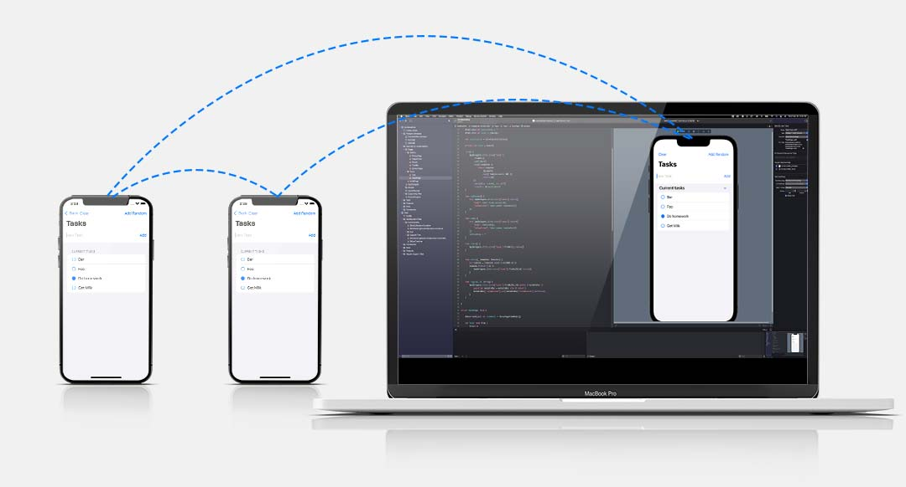

When developing with SwiftUI, you may notice that data from a regular simulator or physical device will sync with a mysterious "other" device. This mysterious device is most likely the SwiftUI Preview Simulator. Simply closing XCode doesn't guarantee that this preview simulator closes. In order to stop this from happening, you'll need to prevent SwiftUI preview simulator from calling `tryStartSync`. 



If you want to check that your runtime is running as a SwiftUI preview, you can read the process environment variables like so:

```swift
let isPreview: Bool = ProcessInfo.processInfo.environment["XCODE_RUNNING_FOR_PREVIEWS"] == "1"
```

To prevent your Ditto instance in the preview from syncing, ensure to wrap `tryStartSync()` in an `if` clause like so:

```swift
let isPreview: Bool = ProcessInfo.processInfo.environment["XCODE_RUNNING_FOR_PREVIEWS"] == "1"

if !isPreview {
  // non preview simulators and real devices can sync 
  try ditto.tryStartSync()
}
```

Remember, a Ditto instance that has not called `tryStartSync` will not connect or replicate to devices that it can discover. However, a device that has not called `tryStartSync` _can still insert, find, observe, update, and remove_ documents as if it were just a local database. 
