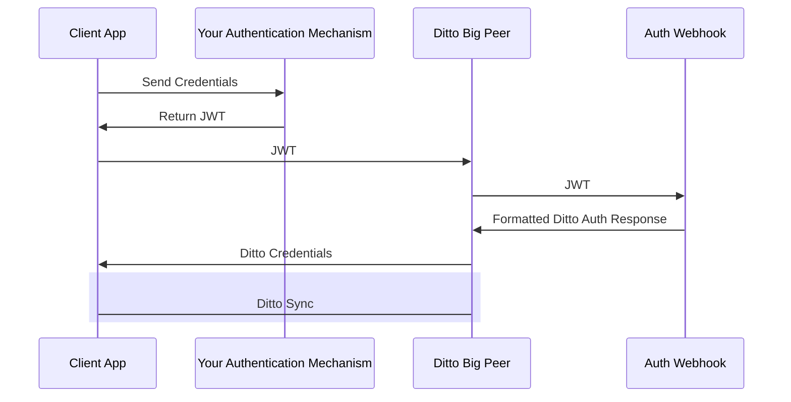
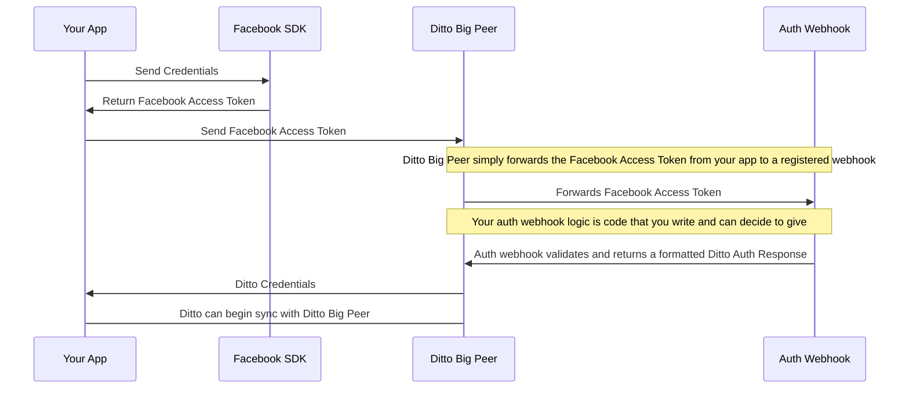

import Tabs from '@theme/Tabs';
import TabItem from '@theme/TabItem';

The "Online With Authentication" identity type is geared towards apps will be deployed in real world settings. "Online With Authentication" identity types are: 

* for apps that need to integrate with existing permissions
* for apps that need to integrate with existing authentication systems

:::info
* The Ditto platform __does not come with an identity provider__. Using "Online With Authentication" requires that that you have your own identity provider already set up. Each app can use multiple identity providers. Identity providers can be:
  * Your own service
  * Facebook, Twitter, GitHub, etc...
  * Okta, Auth0, Stytch, etc...

:::

For a more thorough walkthrough, see the [tutorial](/guides/authentication/intro).  

## How it works

:::caution
Devices using Online with Authentication need to connect to the Internet and
authenticate at least once before syncronizing with other peers. This is
required so devices can get a valid certificate before going offline.  
:::

To use the "Online With Authentication" system, your client application is expected to authenticate with your identity system and retrieve some sort of token _prior_ to syncing with Ditto. Often times this token is some sort of identity token, access token, commonly in the format of a JWT (JSON Web Token).


Once your client application successfully has retrieved this token, it should pass it to the Ditto `authenticator` which will pass it to an authentication webhook. As the developer, you are responsible for writing code and deploying the this webhook to an accessible URL. The authentication webhook will validate and decode the token from the client side and return identity and access control information back to your Ditto instance. 

The full flow is detailed in the diagram below:




## Example of authentication with Facebook and an iOS app with Ditto

Let's say you're using something like Facebook authentication to identity users in __Your App__.

Typically, an iOS application would use the [Facebook SDK](https://developers.facebook.com/docs/ios/) to login and retrieve a Facebook 
[access token](https://developers.facebook.com/docs/facebook-login/access-tokens/#ios). When the Facebook SDK logs in it'll retrieve this access token which you can pass to the Ditto flow. Ditto's Big Peer will forward it to an __Auth WebHook__ which is _an HTTP endpoint where you can write your own logic_. This Auth WebHook HTTP endpoint needs to respond with JSON that describe the user's identity and the permissions.




## Creating your client

Create the ditto client with the `onlineWithAuthentication` identity. This
identity requires an authentication handler `authHandler`.

:::warning
You must refresh the auth token when it expires. You can do that by implementing
`authenticationExpiringSoon`. If you do not implement this, then sync will stop when the token
expires. 
:::

<Tabs
  groupId="programming-language"
  defaultValue="javascript"
  values={[
    {label: 'JavaScript', value: 'javascript'},
    {label: 'Swift', value: 'swift'},
    {label: 'Objective-C', value: 'objc'},
    {label: 'Kotlin', value: 'kotlin'},
    {label: 'Java', value: 'java'},
    {label: 'C#', value: 'csharp'},
    {label: 'C++', value: 'cpp'},
    {label: 'Rust', value: 'rust'},
  ]
}>
<TabItem value="javascript">

```js
import { init, Ditto } from "@dittolive/ditto"
(async () => {
  await init() // you need to call this at least once before using any of the Ditto API

  const authHandler = {
    authenticationRequired: async function(authenticator) {
      console.log("Login request.");
    },
    authenticationExpiringSoon: function(authenticator, secondsRemaining) {
      console.log(`Auth token expiring in ${secondsRemaining} seconds`)
    }
  }

  const identity = {
    type: 'onlineWithAuthentication',
    appID: 'REPLACE_ME_WITH_YOUR_APP_ID',
    authHandler
  }

  const ditto = new Ditto(identity, '/persistence/file/path')
  ditto.tryStartSync()
})()
```

</TabItem>
<TabItem value="swift">

```swift
struct AuthDelegate: DittoAuthenticationDelegate {
    func authenticationRequired(authenticator: DittoAuthenticator) {
        print("Login request.)
    }

    func authenticationExpiringSoon(authenticator: DittoAuthenticator, secondsRemaining: Int64) {
        print("Auth token expiring in \(secondsRemaining)")
    }
}

let identity = DittoIdentity.onlineWithAuthentication(
    appID: "REPLACE_ME_WITH_YOUR_APP_ID",
    authenticationDelegate: AuthDelegate()
)

let ditto = Ditto(identity: identity)
try! ditto.tryStartSync()
```

</TabItem>
<TabItem value="objc">

```objc
@interface AuthDelegate : NSObject <DITAuthenticationDelegate>
@end

@implementation AuthDelegate
- (void)authenticationRequired:(nonnull DITAuthenticator *)authenticator {
      NSLog(@"Login request.");
}

- (void)authenticationExpiringSoon:(nonnull DITAuthenticator *)authenticator
                  secondsRemaining:(int64_t)secondsRemaining {
    NSLog(@"Auth token expiring in %lld seconds", secondsRemaining);
}
@end

DITIdentity *identity = [[DITIdentity alloc] initOnlineWithAuthenticationWithAppID:@"REPLACE_ME_WITH_YOUR_APP_ID"
                                                            authenticationDelegate:[[AuthDelegate alloc] init];
DITDitto *ditto = [[DITDitto alloc] initWithIdentity:identity];
NSError *error = nil;
[ditto tryStartSync:&error];
```

</TabItem>
<TabItem value="kotlin">

```kotlin
class AuthCallback: DittoAuthenticationCallback {
    override fun authenticationRequired(authenticator: DittoAuthenticator) {
        println("Login request.")
    }

    override fun authenticationExpiringSoon(
        authenticator: DittoAuthenticator,
        secondsRemaining: Long
    ) {
        println("Auth token expiring in $secondsRemaining seconds")
    }
}

val androidDependencies = AndroidDittoDependencies(context)
val identity = DittoIdentity.OnlineWithAuthentication(
    androidDependencies,
    "REPLACE_ME_WITH_YOUR_APP_ID",
    AuthCallback()
)
val ditto = Ditto(androidDependencies, identity)
try {
  ditto.tryStartSync()
} catch(e: DittoError) {
  Log.e("Ditto error", e.message!!)
}
```

</TabItem>
<TabItem value="java">

```java

class AuthCallback implements DittoAuthenticationCallback {
    @Override
    public void authenticationRequired(@NonNull DittoAuthenticator authenticator) {
        System.out.println("Login request.");
    }

    @Override
    public void authenticationExpiringSoon(@NonNull DittoAuthenticator authenticator, long secondsRemaining) {
        System.out.println("Auth token expiring in " + secondsRemaining + " seconds");
    }
}

DittoDependencies androidDependencies = new DefaultAndroidDittoDependencies(this.context);
DittoIdentity identity = new DittoIdentity.OnlineWithAuthentication(
    customDirDependencies,
    "REPLACE_ME_WITH_YOUR_APP_ID",
    new AuthCallback()
);
Ditto ditto = new Ditto(androidDependencies);

try {
  ditto.tryStartSync();
} catch(DittoError e) {
  Log.e("Ditto Error", e.getMessage())
}
```

</TabItem>
<TabItem value="csharp">

```csharp
class AuthDelegate : IDittoAuthenticationDelegate
{
    public async void AuthenticationRequired(DittoAuthenticator authenticator)
    {
        System.Console.WriteLine($"Login request");
    }

    public async void AuthenticationExpiringSoon(DittoAuthenticator authenticator, long secondsRemaining)
    {
        System.Console.WriteLine($"Auth token expiring in {secondsRemaining} seconds");
    }
}

var identity = DittoIdentity.OnlineWithAuthentication(
    "REPLACE_ME_WITH_YOUR_APP_ID",
    new AuthDelegate());

try
{
    var ditto = new Ditto(identity);
    ditto.TryStartSync();
}
catch (DittoException ex)
{
    System.Console.WriteLine($"Ditto Error {ex.Message}");
}
```

</TabItem>
<TabItem value="cpp">

```cpp
class AuthCallback: public AuthenticationCallback {
public:
  void authentication_required(std::shared_ptr<Authenticator> authenticator) {
      std::cout << "Login request" << std::endl;
  }

  void authentication_expiring_soon(std::shared_ptr<Authenticator> authenticator,
                                    std::int64_t seconds_remaining) {
    std::cout << "Auth token expiring in " << seconds_remaining << " seconds" << std::endl;
  }
};

Identity identity = Identity::OnlineWithAuthentication(
  "REPLACE_ME_WITH_YOUR_APP_ID",
  std::make_shared<AuthCallback>()
);
try {
  Ditto ditto = Ditto(identity, "/your-persistence-path");
  ditto.try_start_sync();
} catch (const DittoError &err) {
  std::cout << err.what() << std::endl;
}
```

</TabItem>

<TabItem value="rust">

```rust
use dittolive_ditto::prelude::*;
use std::sync::Arc;
use std::time::Duration;

struct AuthHandler {
    token: String,
    provider: String,
}

impl DittoAuthenticationEventHandler for AuthHandler {
    fn authentication_required(&self, auth: dittolive_ditto::auth::DittoAuthenticator) {
        ::log::info!("Login request.");
    }

    fn authentication_expiring_soon(
        &self,
        _auth: dittolive_ditto::auth::DittoAuthenticator,
        seconds_remaining: std::time::Duration,
    ) {
        ::log::info!(
            "Auth token expiring in {} seconds",
            seconds_remaining.as_secs()
        );
    }
}

impl Default for AuthHandler {
    fn default() -> Self {
        AuthHandler {
            token: ThirdPartyAuth::get_token(),
            provider: String::from("my-auth"),
        }
    }
}

let mut ditto = Ditto::builder()
    // creates a `ditto_data` folder in the directory containing the executing process
    .with_root(Arc::new(PersistentRoot::current_exe()?))
    .with_identity(|ditto_root| {
      // Provided as an env var, may also be provided as hardcoded string
      let app_id = AppId::from_env("DITTO_APP_ID")?;
      let auth_event_handler = AuthHandler::default();
      let enable_cloud_sync = true;
      let custom_auth_url = None;
      // return the Result<Identity, _> at the end of this closure
      OnlineWithAuthentication::new(
          ditto_root,
          app_id,
          auth_event_handler,
          enable_cloud_sync,
          custom_auth_url,
      )
    })
    .with_transport_config(|_identity| {
        let mut config = TransportConfig::enable_all_peer_to_peer()
    })
    .build()?;

ditto.try_start_sync()?;
```

</TabItem>
</Tabs>

## Login

Login takes two paramters: the first is `token`, which should be a JSON web
token (JWT). The second paramter is the name of the provider which you must add
through the Ditto portal.


<Tabs
  groupId="programming-language"
  defaultValue="javascript"
  values={[
    {label: 'JavaScript', value: 'javascript'},
    {label: 'Swift', value: 'swift'},
    {label: 'Objective-C', value: 'objc'},
    {label: 'Kotlin', value: 'kotlin'},
    {label: 'Java', value: 'java'},
    {label: 'C#', value: 'csharp'},
    {label: 'C++', value: 'cpp'},
    {label: 'Rust', value: 'rust'}
  ]
}>
<TabItem value="javascript">

```js
let accessToken = await ThirdPartyAuth.getToken()
await ditto.auth.loginWithToken(accessToken, 'my-auth')
```

</TabItem>
<TabItem value="swift">

```swift
ditto.auth.loginWithToken(ThirdPartyAuth.getToken(), provider: "my-auth") { err in
    print("Login request completed. Error? \(err)")
}
```

</TabItem>
<TabItem value="objc">

```objc
[ditto auth loginWithToken:[ThirdPartyAuth getToken] provider:@"my-auth" completion:^(NSError * _Nullable err) {
    NSLog(@"Login request completed. Error? %@", err);
}];
```

</TabItem>
<TabItem value="kotlin">

```kotlin
ditto.auth.loginWithToken(ThirdPartyAuth.getToken(), "my-auth") { err ->
    println("Login request completed. Error? $err")
}
```

</TabItem>
<TabItem value="java">

```java
ditto.auth.loginWithToken(credentials.accessToken, "my-auth", err -> {
    System.out.println("Login request completed. Error? " + err.toString());
});
```

</TabItem>
<TabItem value="csharp">

```csharp
var res = await authenticator.LoginWithToken(ThirdPartyAuth.GetToken(), "my-auth");
System.Console.WriteLine($"Login request completed. Error? {res}");
```

</TabItem>
<TabItem value="cpp">

```cpp
authenticator->login_with_token("123", "my-auth", [](std::unique_ptr<DittoError> err) {
  std::cout << "Login request completed. Error?" << err->what() << std::endl;
});
```

</TabItem>
<TabItem value="rust">

  ```rust
  auth.login_with_token(&self.token, &self.provider) {
      ::log::info!("Login request completed. Error? {:?}", &e);
  }
  ```

</TabItem>
<TabItem value="http">

  ```bash
  curl -X DELETE 'https://<CLOUD_ENDPOINT>/api/v1/collections/people/documents/<doc_id>' \
    --header 'X-DITTO-CLIENT-ID: AAAAAAAAAAAAAAAAAAAABQ==' \
    --header 'Content-Type: application/json' 
  ```

</TabItem>
</Tabs>

## Logout

Logout will stop sync, shut down all replication sessions, and remove any cached
authentication credentials. Note that this does not remove any data from the
store. If you wish to delete data from the store then use the optional
`cleanupFn` parameter to perform any required cleanup.

The `cleanupFn` is an optional function that will be called with the relevant Ditto
instance as the sole argument that allows you to perform any required cleanup of
the store as part of the logout process.


<Tabs
  groupId="programming-language"
  defaultValue="javascript"
  values={[
    {label: 'JavaScript', value: 'javascript'},
    {label: 'Swift', value: 'swift'},
    {label: 'Objective-C', value: 'objc'},
    {label: 'Kotlin', value: 'kotlin'},
    {label: 'Java', value: 'java'},
    {label: 'C#', value: 'csharp'},
    {label: 'C++', value: 'cpp'},
    {label: 'Rust', value: 'rust'}
  ]
}>
<TabItem value="javascript">

```js
async function cleanupFn (ditto) {
  await ditto.store.collection('cars').findAll().evict()
}
await ditto.auth.logout(cleanupFn)
```

</TabItem>
<TabItem value="swift">

```swift
ditto.auth.logout(cleanup: { ditto in
    ditto.store.collection("cars").findAll().evict()
})
```

</TabItem>
<TabItem value="objc">

```objc
[ditto.auth logout:^(DITDitto *ditto) {
  DITCollection *collection = [ditto.store collection:@"cars"];
  [[collection findAll] evict];
}];
```

</TabItem>
<TabItem value="kotlin">

```kotlin
ditto.auth.logout {
  ditto.store["cars"].findAll().evict()
}
```

</TabItem>
<TabItem value="java">

```java
 ditto.auth.logout(ditto -> {
  ditto.store.collection("cars").findAll().evict();
 })
```

</TabItem>
<TabItem value="csharp">

```csharp
ditto.Auth.Logout((Ditto ditto) =>
{
  ditto.Store.Collection("cars").FindAll().evict();
});
```

</TabItem>
<TabItem value="cpp">

```cpp
ditto.auth.logout({
  ditto.store.collection("cars").findAll().evict();
})
```

</TabItem>
<TabItem value="rust">

```rust
ditto.auth.logout(|ditto| {
  ditto.store().collection("cars")?.find_all().evict()?;
});
```

</TabItem>
</Tabs>
