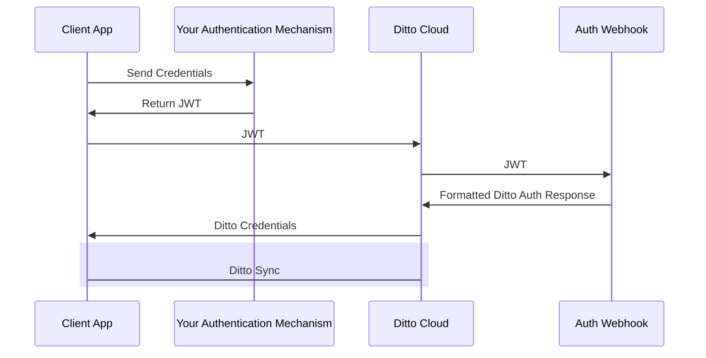
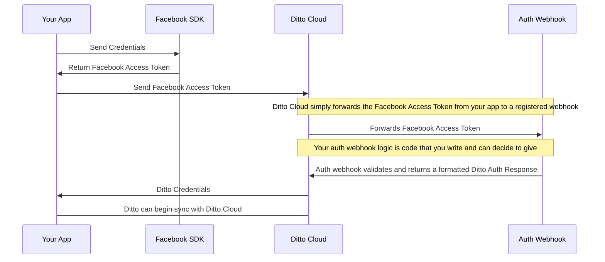

The "Online With Authentication" identity type is geared towards apps will be deployed in real world settings. "Online With Authentication" identity types are: 

* for apps that need to integrate with existing permissions
* for apps that need to integrate with existing authentication systems

:::info
* The Ditto platform __does not come with an identity provider__. Using "Online With Authentication" requires that that you have your own identity provider already set up. Each app can use multiple identity providers. Identity providers can be:
  * Your own service
  * Facebook, Twitter, GitHub, etc...
  * Okta, Auth0, Stytch, etc...

:::

To use the "Online With Authentication" system, your client application is expected to authenticate with your identity system and retrieve some sort of token _prior_ to syncing with Ditto. Often times this token is some sort of identity token, access token, commonly in the format of a JWT (JSON Web Token).

Once your client application successfully has retrieved this token, it should pass it to the Ditto `authenticator` which will pass it to an authentication webhook. As the developer, you are responsible for writing code and deploying the this webhook to an accessible URL. The authentication webhook will validate and decode the token from the client side and return identity and access control information back to your Ditto instance. 

The full flow is detailed in the diagram below:

## Example of authentication with Facebook and an iOS app with Ditto

Let's say you're using something like Facebook authentication to identity users in __Your App__.

Typically, an iOS application would use the [Facebook SDK](https://developers.facebook.com/docs/ios/) to login and retrieve a Facebook 
[access token](https://developers.facebook.com/docs/facebook-login/access-tokens/#ios). When the Facebook SDK logs in it'll retrieve this access token which you can pass to the Ditto flow. Ditto's cloud will forward it to an __Auth WebHook__ which is _an HTTP endpoint where you can write your own logic_. This Auth WebHook HTTP endpoint needs to respond with JSON that describe the user's identity and the permissions.

