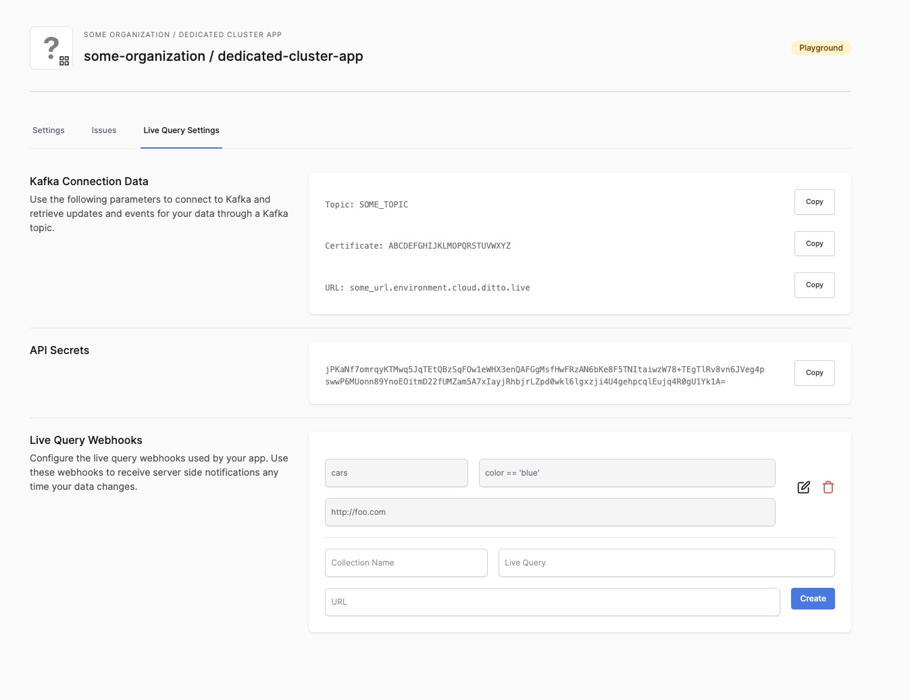

# Enabling Kafka

Ditto supports connecting to Kafka and retrieving updates and events for your data through a Kafka topic. 

:::info

The Kafka settings are only enabled if your Organization is on a dedicated cluster. Contact us if you are interested in this feature.

:::

## Installing Kafka

First, follow the instructions on [Kafka Quickstart](https://kafka.apache.org/quickstart) to try out basic Kafka locally. 

## Handling credentials 

When you query the Big Peer, you must provide the proper credentials. In your organization page, click "Live Query Settings" and you will see the credentials for your cluster. Copy the Cluster Certificate and User Certificate into text files locally and give them good names. Keep these files safe!



## Simple test

You can use the following command to test out your cluster.

```bash
bin/kafka-console-consumer.sh --bootstrap-server <your-endpoint>:443 \
--consumer-property security.protocol=SSL \
--consumer-property ssl.truststore.password=<CLUSTER_CERTIFICATE_PASSWORD> \
--consumer-property ssl.truststore.location=/path/to/my/cluster_certificate.txt \
--consumer-property ssl.keystore.location=<USER_CERTIFICATE_PASSWORD> \
--consumer-property ssl.keystore.password=/path/to/my/user_certificate.txt \
--group user-consumable-<your-app_id> \
--topic user-consumable-<your_app_id>
```

## Using configuration files

Kafka instances have a `conf/server.properties` configuration file which can be used to specify the credentials so you don't need to pass them in on every consumer call.

| | Ditto Name | Description |
| --- | --- | --- |
| `ssl.truststore.location` |   Cluster Certificate |  The CA cert to be used for kafka in PKCS12 format.|
| `ssl.truststore.password` |  Cluster Certificate Password | The password used to decrypt the PKCS12 value. |
| `ssl.keystore.location` |  User Certificate | User cert again in PKCS12 format once base64 decoded.|
| `ssl.keystore.password` |  User Certificate password | The password used to decrypt the PKCS value. |


For example, adding the above fields to `server.properties` would look something like:

```
ssl.truststore.location=/path/to/my/cluster_certificate.txt
ssl.truststore.password=<CLUSTER_CERTIFICATE_PASSWORD>
ssl.keystore.location=/path/to/my/user_certificate.txt
ssl.keystore.password=<USER_CERTIFICATE_PASSWORD>
```
