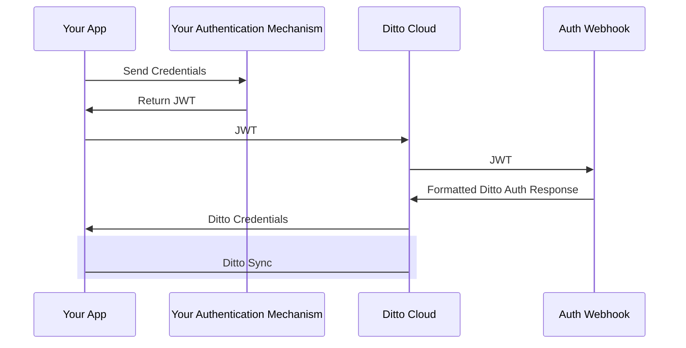
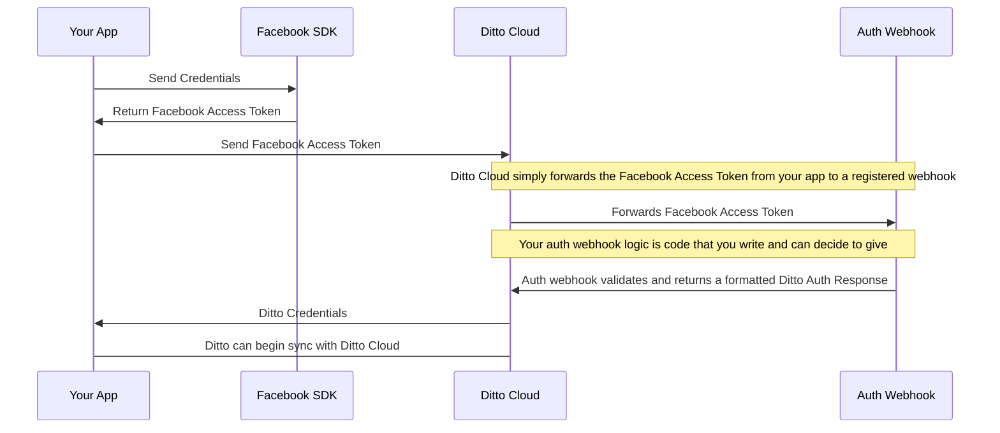

Building complex collaborative apps need robust authentication and access control mechanisms. However, in most applications, users need explicit permissions on what they can read or edit. We call the ability to change permissions __Access Control__ and the specific way to identify each user __Authentication__.

:::info
The following section requires basic knowledge of writing HTTP APIs and returning JSON formatted responses.
:::
## Authentication Flow

Ditto's Cloud platform piggybacks on an existing authentication mechanism. Currently, this means that Ditto Cloud does not come with an out-of-the-box identity provider. Therefore, before deploying your app to production, you will need to integrate your authentication system with Ditto Cloud in the form of an __Auth Webhook__. 

:::info
The __Auth Webhook__ is an HTTP endpoint that your organization will write and maintain. Ditto Cloud only needs to know of this HTTP endpoint's URL.
:::



### Example of authentication with Facebook and an iOS app with Ditto

Let's say you're using something like Facebook authentication to identity users in __Your App__.

Typically, an iOS application would use the [Facebook SDK](https://developers.facebook.com/docs/ios/) to login and retrieve a Facebook 
[access token](https://developers.facebook.com/docs/facebook-login/access-tokens/#ios). When the Facebook SDK logs in it'll retrieve this access token which you can pass to the Ditto flow. Ditto's cloud will forward it to an __Auth WebHook__ which is _an HTTP endpoint where you can write your own logic_. This Auth WebHook HTTP endpoint needs to respond with JSON that describe the user's identity and the permissions.



## Designing Access Control 

Access control describes what documents a user can or cannot read or write. Again, we leverage the existing [Ditto query language](/concepts/querying) to describe these rules. 

:::info
Currently, Ditto is only able to provide access control rules on document `_id` fields. It is not able to provide access control on mutable properties. However, we are working towards the ability to write access rules on all document properties.
:::

```jsonc
{
  "authenticate": true,
  "identity": {
      "provider": "facebook",
      "id": true
  },
  "expirationSeconds": 3600,
  "permissions": {
      "read": {
          "everything": true,
          "queriesByCollection": {
              "cars": ["_id == 'my-specific-id'", "_id == 'id1' || _id == 'id2"],
              "boats": ["_id > 100", "_id > -10 && _id < 10"],
              "foods": ["_id == false"],
              "books": ["endsWith(_id, 'Potter')"]
          }
      },
      "write": {
          "everything": true,
          "queriesByCollection": {
              "cars": ["_id.price > 1500 && _id.currency == 'USD'", "_id.color == 'red"],
              "boats": ["regex(_id, '^Wave.*')"]
          }
      },
  }
}
```