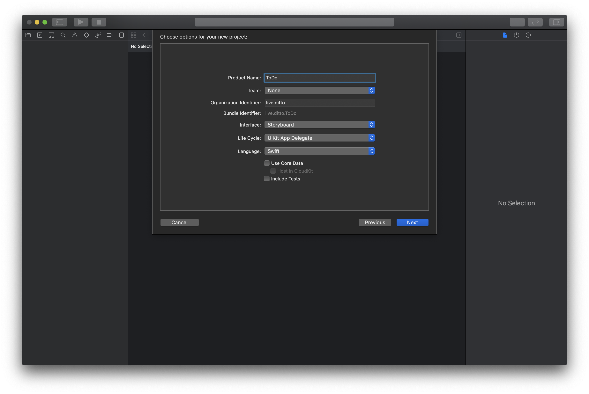
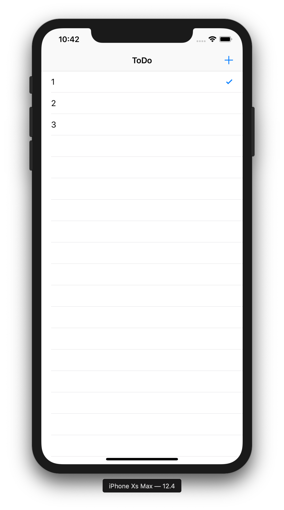

## 1-1 Create the App

The first step is to create a basic Xcode project. Go to File New → Project and select "App":

Next, fill out the options with the product name: "Tasks" and choose the following values.

* For "Interface" -> "Storyboard"
* For "Life Cycle" -> "UIKit App Delegate"
* For Language -> "Swift"

## 1-2 Create the UI Interface

The UI for the app will look like this:

This requires that we create several elements:

1. `UINavigationController` to represent the top navigation bar
2. `UITableViewController` which contains the UITableView to display the list of tasks
3. `UIBarButtonItem` which is in the navigation bar to display the UIAlertController to input the task name
For simplicity we will use the built-in storyboard to create these.

First, we need to add a new file to the project for the `UITableViewController`. Go to File New → File and select "Cocoa Touch Class":

Name your class `TasksTableViewController` and make sure it is a subclass of `UITableViewController`:

You can then delete the `ViewController.swift` file from the project so your structure should now look like this:

Now the project is set up, so we can configure `Main.storyboard` to create the UI.

## 1-3 Configure Storyboard

Click on `Main.storyboard` to load the storyboard editor. The initial storyboard includes a scene tied to the ViewController. We deleted it, so we need to remove it and add a `UINavigationController` . Click on the View Controller Scene on the left-hand panel and click delete so the storyboard is now empty:

Now we need to add a `UINavigationController` into the storyboard. Click the circle with a square in it icon in the top right to display your list of UI elements and search for `UINavigationController` and click to add it to the storyboard. You should end up with this:

This created a `UINavigationController` and a root view controller based on `UITableViewController`, but it needs to be configured to work with our `TasksTableViewController.swift` file. Click on the "Root View Controller Scene" and navigate the right hand menu to declare the `UITableViewController` as a custom class of `TasksTableViewController`:

Next, we need to ensure that the "Navigation Controller Scene" is the initial view controller for our app, so click on it and navigate the right hand menu to set this property:

Now we need to customize the `UITableViewController` to include the add task button. Click on the "Root View Controller Scene" and then click the "Circle with square" icon in the top right to add a `UIBarButtonItem` , search for "Bar Button Item" and drag it onto the top right corner of the `UINavigationBar`. Finally, configure the bar item to use the "System Item" "Add" in the right-hand menu:

The last configuration is to adjust the name in the navigation bar to "Tasks", click on the "Root View Controller" text and navigate the right-hand menu to adjust the name:

Great! We have the UI elements in place, but now we need to wire them up, or connect them with our implementation code in `TasksTableViewController`.

## 1-4 Wire Up UI

First, we need to declare a function that will called when the user clicks on the add icon in the navigation bar. To do so, click the "Show Assistant Editor" button in the top right so that our storyboard and `TaskTableViewController.swift` file are both displayed:

Now, right click on the add button and drag it into the class implementation of `TasksTableViewController` just above the `numberOfSections()` function:

Name the function `didClickAddTask` and adjust the type to `UIBarButtonItem` and click connect. You should now have a function that is wired up to be called whenever that button is clicked:

Finally, we will need to configure `UITableView` in `TasksTableViewController` and as part of this, we need to provide a "Table view cell reuse identifier", so let's configure our storyboard cell to include an identifier. Click on the "Prototype Cells" area in your view and navigate the right-hand menu to display the configuration for the "Table View Cell" and insert `taskCell` as the identifier:

Almost done! Our UI is now setup and configured, all that is left is to add Ditto and the associated logic to create and display tasks!
